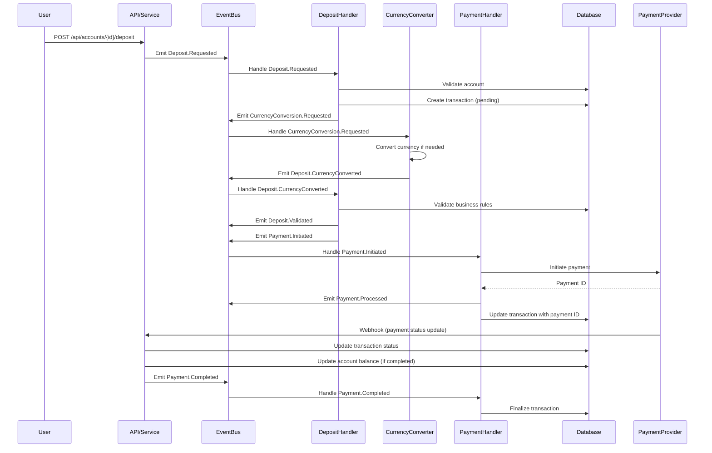

# 🏗️ Architecture Overview

This document describes the architecture of the Fintech Platform, including its core principles, structure, and best practices.

---

## 🏁 Principles

- Clean architecture
- Domain-driven design (DDD)
- Separation of concerns
- Dependency injection
- Testability

---

## 🧭 Project Structure

- `cmd/` — Application entry points
- `pkg/` — Domain, service, repository, middleware, etc.
- `webapi/` — HTTP handlers and API endpoints
- `infra/` — Infrastructure layer (database, models)
- `internal/` — Internal utilities and fixtures
- `docs/` — Documentation and OpenAPI specs

---

## 🧰 Key Technologies

- Go (Fiber, GORM, JWT)
- go-playground/validator
- Google UUID

---

## 🏅 Best Practices

- Keep business logic in the domain layer
- Use interfaces for dependency inversion
- Implement repository pattern with Unit of Work
- Use property-style getters for entities
- Centralize validation and error handling

---

## 🔮 Looking Forward

- Expand event-driven architecture
- Add more payment providers
- Enhance observability and monitoring

## Event-Driven Deposit Workflow (CQRS, Money Conversion)

This workflow illustrates how a deposit is processed in an event-driven, CQRS-based fintech system, including money conversion if needed:



## Event Payloads and Handlers

### 1. `Deposit.Requested`

**Emitted by**: API Layer when deposit is initiated

**Payload**:

```go
type DepositRequested struct {
    FlowEvent      // Contains ID, UserID, AccountID, CorrelationID
    Amount        money.Money  // Requested amount and currency
    Source        string       // Payment source identifier
    TransactionID uuid.UUID    // Unique ID for this transaction
}

**Handler**: `deposit.HandleRequested`

**Responsibilities**:
- Validate account exists and is active
- Create pending transaction record
- Emit `CurrencyConversion.Requested` with original amount and target currency
- Handle validation errors by emitting `Deposit.Failed`
- Log all operations for audit trailed

### 2. `CurrencyConversion.Requested`

**Emitted by**: Deposit Handler when currency conversion is needed

**Payload**:

```go
type CurrencyConversionRequested struct {
    FlowEvent
    FromCurrency currency.Code
    ToCurrency   currency.Code
    Amount       money.Money
    TransactionID uuid.UUID
    OriginalRequest interface{} // Original request that triggered the conversion
}
```

**Handler**: `conversion.HandleRequested`

**Responsibilities**:

- Convert amount between currencies using exchange rates
- Apply currency conversion fees if applicable
- Emit `Deposit.CurrencyConverted` with converted amount
- Handle conversion failures by emitting `CurrencyConversion.Failed`
- Log conversion details for audit and reconciliation

### 3. `Deposit.CurrencyConverted`

**Emitted by**: Currency Conversion Service after successful conversion

**Payload**:

```go
type DepositCurrencyConverted struct {
    FlowEvent
    TransactionID    uuid.UUID
    OriginalAmount   money.Money
    ConvertedAmount  money.Money
    ConversionRate   decimal.Decimal
    ConversionFee    money.Money
}
```

**Handler**: `deposit.HandleCurrencyConverted`

**Responsibilities**:

- Validate conversion results
- Apply business rules for converted amounts
- Emit `Deposit.Validated`
- Emit `Payment.Initiated` to start payment processing
- Log conversion details for audit

### 4. `Deposit.Validated`

**Emitted by**: Deposit Handler after successful validation

**Payload**:

```go
type DepositValidated struct {
    DepositCurrencyConverted
    ValidatedAt time.Time
}
```

**Handler**: `deposit.HandleValidated`

**Responsibilities**:

- Final validation of deposit request
- Verify account limits and business rules
- Log validation results
- Prepare for payment initiation

### 5. `Payment.Initiated`

**Emitted by**: Deposit Handler after validation

**Payload**:

```go
type PaymentInitiated struct {
    FlowEvent
    TransactionID uuid.UUID
    Amount        money.Money
    PaymentMethod string
    PaymentID     string
    Status        string
}
```

**Handler**: `payment.HandleInitiated`

**Responsibilities**:

- Initiate payment with payment provider
- Handle payment provider communication
- Emit `Payment.Processed` on success or `Payment.Failed` on error
- Implement retry logic for transient failures
- Log payment initiation details

### 6. `Payment.Processed`

**Emitted by**: Payment Handler after payment processing

**Payload**:

```go
type PaymentProcessed struct {
    PaymentInitiated
    PaymentID         string
    Status            string
    ProcessedAt       time.Time
}
```

**Handler**: `payment.HandleProcessed`

**Responsibilities**:

- Update transaction with payment reference
- Trigger balance update if payment is completed
- Handle retries for failed payments

## Webhook Integration

Payment providers notify the system of payment status changes via webhooks:

1. **Endpoint**: `POST /api/webhooks/payments/{provider}`
2. **Authentication**: HMAC signature verification
3. **Flow**:
   - Verify webhook signature
   - Look up transaction by reference
   - Update transaction status
   - If payment completed, update account balance
   - Emit appropriate domain events

## Error Handling

- Failed payments trigger `PaymentFailed` events
- Automatic retries for transient failures
- Dead-letter queue for unprocessable events
- Comprehensive logging and monitoring
