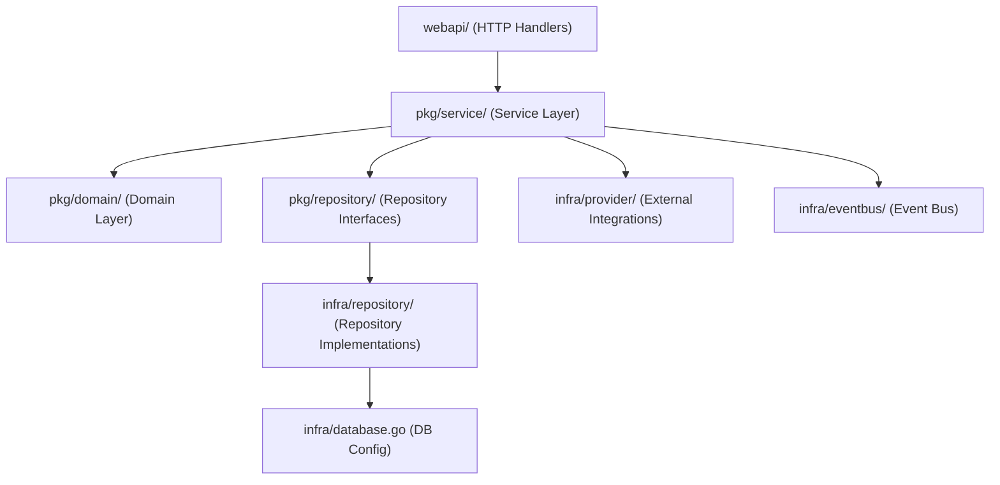
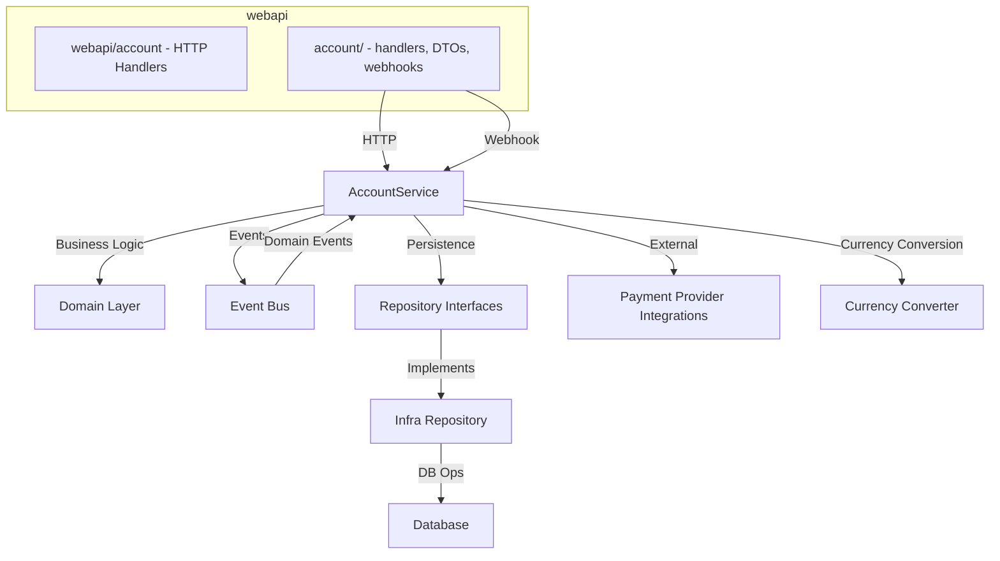
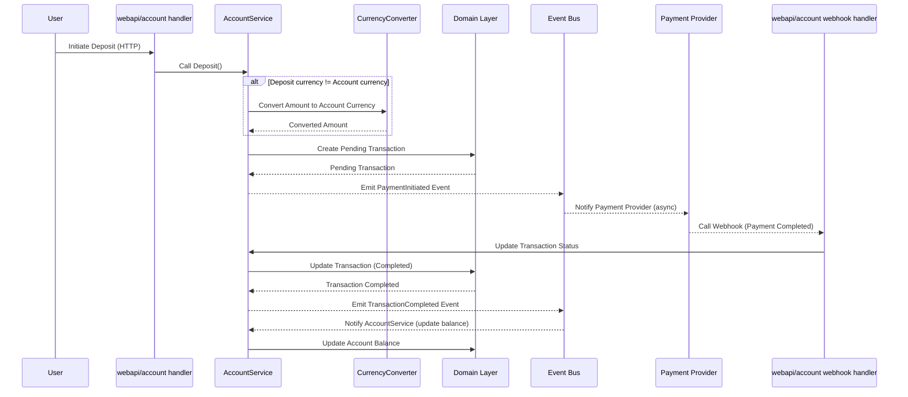

# Fintech Project Architecture

## Overview

This project is a modern fintech backend built in Go, following **Clean Architecture** and **Domain-Driven Design (DDD)** principles. It is designed for maintainability, testability, and scalability, with a strong focus on separation of concerns, dependency injection, robust transaction management, and now an **event-driven, invariant-enforcing architecture**.

---

## High-Level Architecture

- **webapi/**: Thin HTTP handlers, request/response parsing, validation. All orchestration is delegated to services.
- **pkg/service/**: Application/business logic, orchestrates use cases, manages transactions, emits and handles events.
- **pkg/domain/**: Pure business entities and rules, all business invariants (e.g., no negative balances) enforced here.
- **pkg/repository/**: Repository interfaces for persistence abstraction.
- **infra/repository/**: Concrete repository implementations (GORM, etc.).
- **infra/database.go**: Database connection and migration logic.
- **infra/provider/**: Payment providers, currency converters, etc.
- **infra/eventbus/**: Internal event bus for propagating domain and integration events.

---

## Event-Driven Architecture

- **Initiate Payment**: User requests deposit/withdraw; a pending transaction is created and a PaymentInitiated event is emitted.
- **Async Confirmation**: Payment provider (real or mock) sends webhook/callback when payment is completed or failed.
- **Webhook Handler**: Receives payment status updates, updates transaction status, and emits domain events (e.g., TransactionCompleted).
- **Event Bus**: Internal event bus propagates domain events (e.g., TransactionCompleted, BalanceUpdated) to update account balances and trigger side effects.
- **Strict Invariants**: All balance updates and business rules are enforced in the domain layer; negative balances are never allowed.

**Example Flow:**

1. User initiates a deposit (API call)
2. System creates a pending transaction and emits a PaymentInitiated event
3. Payment provider processes the payment and calls the webhook with the result
4. Webhook handler updates the transaction status and emits a TransactionCompleted event
5. Event bus handler updates the account balance if the transaction is completed

See: `docs/event_driven_payments.md`

---

## Core Architecture Patterns

### Clean Architecture & DDD

- **Separation of Concerns**: Each layer has a single responsibility.
- **Dependency Inversion**: Services depend on interfaces, not implementations.
- **Domain-Driven Design**: Business rules and invariants live in the domain layer.

### Dependency Injection

- All dependencies (repositories, providers, loggers, event bus) are injected via constructors.
- Enables easy mocking and testing.

### Repository & Unit of Work Pattern

- **Repositories** abstract data access and are injected into services.
- **Unit of Work** ensures all repository operations in a use case share the same DB transaction.
- See `pkg/repository/uow.go` and `infra/repository/uow.go`.

---

## Project Structure

## Account Deposit Event-Driven Sequence

---

## Strict Balance Invariants

- All balance updates are performed via domain methods that enforce business invariants.
- **Negative balances are never allowed**; withdrawals and transfers will fail if funds are insufficient.
- All business rules are enforced in the domain layer, not in handlers or services.

---

## Refactoring & Patterns

- **Event-Driven Refactor**: All payment and transaction flows are now event-driven. Legacy persistence handler and operation chain patterns have been removed.
- **Unit of Work**: All repository access is transactional and type-safe. See `docs/uow_pattern_improvements.md`.

---

## Key References

- [Project Overview](README.md)
- [Event-Driven Payments](docs/event_driven_payments.md)
- [Account Service Refactoring](docs/account_service_refactoring_patterns.md)
- [Architecture Patterns](ARCHITECTURE.md)
- [OpenAPI Spec](docs/openapi.yaml)

---

## Breaking Changes & Migration Notes

- **Event-Driven Payments**: All deposit/withdrawal flows are now event-driven. Balances update only after payment completion events (via webhook).
- **Strict Balance Invariants**: Negative balances are strictly prevented at the domain layer. Withdrawals and transfers will fail if funds are insufficient.
- **Handler/Service Refactor**: HTTP handlers are now thin; all business logic is in services and the domain layer. Legacy persistence handler code has been removed.
- **Transaction Creation**: All transaction creation is now centralized and event-driven. Direct DB writes or legacy patterns are no longer supported.
- **API/Contract Changes**: Some endpoints and request/response formats have changed. See the OpenAPI spec for details.
- **Testing**: Tests must set up event flows and use the new service interfaces. See updated test examples.
- **Migration**: Existing data may need to be migrated to support new transaction and event models. Review migration scripts and test thoroughly.

---

## For Contributors

- Follow clean architecture and DDD principles.
- Inject all dependencies via constructors.
- Place business rules in the domain layer.
- Use interfaces for all cross-layer dependencies.
- Write tests for all new features and changes, using the event-driven flow and new service interfaces.

For more, see the [docs/](docs/) directory and in-code GoDoc comments.
