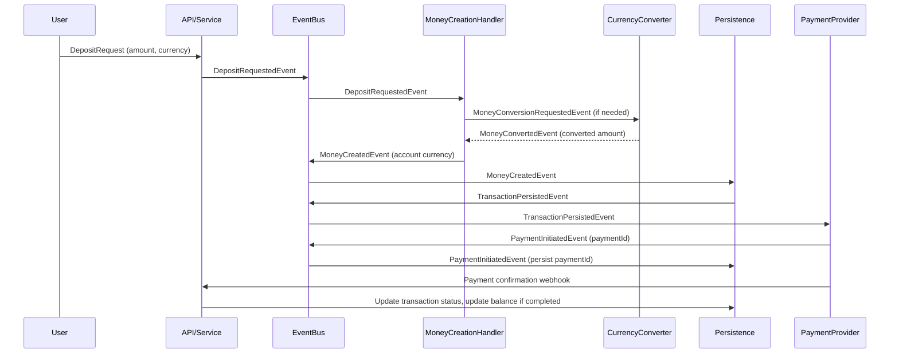

# 🏗️ Architecture Overview

This document describes the architecture of the Fintech Platform, including its core principles, structure, and best practices.

---

## 🏁 Principles

- Clean architecture
- Domain-driven design (DDD)
- Separation of concerns
- Dependency injection
- Testability

---

## 🧭 Project Structure

- `cmd/` — Application entry points
- `pkg/` — Domain, service, repository, middleware, etc.
- `webapi/` — HTTP handlers and API endpoints
- `infra/` — Infrastructure layer (database, models)
- `internal/` — Internal utilities and fixtures
- `docs/` — Documentation and OpenAPI specs

---

## 🧰 Key Technologies

- Go (Fiber, GORM, JWT)
- go-playground/validator
- Google UUID

---

## 🏅 Best Practices

- Keep business logic in the domain layer
- Use interfaces for dependency inversion
- Implement repository pattern with Unit of Work
- Use property-style getters for entities
- Centralize validation and error handling

---

## 🔮 Looking Forward

- Expand event-driven architecture
- Add more payment providers
- Enhance observability and monitoring

## Event-Driven Deposit Workflow (CQRS, Money Conversion)

This workflow illustrates how a deposit is processed in an event-driven, CQRS-based fintech system, including money conversion if needed:

**Workflow Steps:**

1. User submits a deposit request (amount, currency, etc.).
2. API emits a `DepositRequestedEvent`.
3. MoneyCreationHandler creates a Money value object. If conversion is needed, emits a `MoneyConversionRequestedEvent` and waits for a `MoneyConvertedEvent`.
4. Emits a `MoneyCreatedEvent` in the account's currency.
5. Persistence handler saves the transaction and emits a `TransactionPersistedEvent`.
6. Payment provider handler initiates payment and emits a `PaymentInitiatedEvent` (with paymentId).
7. Persistence handler updates the transaction with the paymentId.
8. On payment provider webhook, the API updates the transaction status and account balance if payment is completed.
