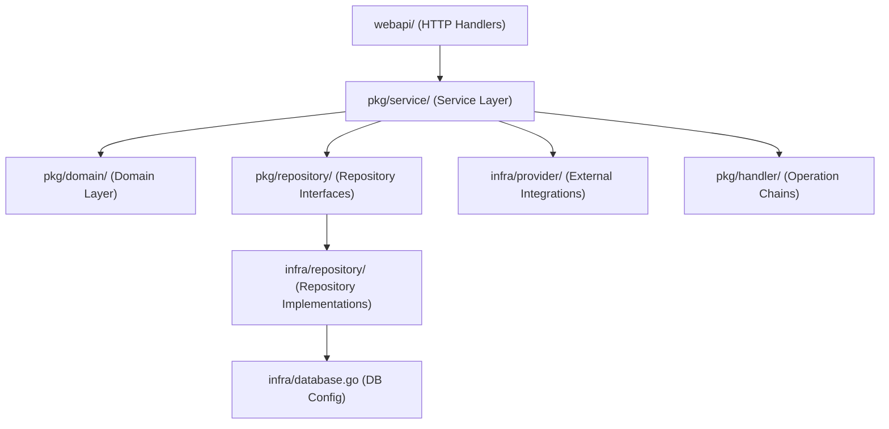

# Fintech Project Architecture

## Overview

This project is a modern fintech backend built in Go, following **Clean Architecture** and **Domain-Driven Design (DDD)** principles. It is designed for maintainability, testability, and scalability, with a strong focus on separation of concerns, dependency injection, and robust transaction management.

---

## High-Level Architecture



- **webapi/**: HTTP handlers, request/response parsing, validation.
- **pkg/service/**: Application/business logic, orchestrates use cases, manages transactions.
- **pkg/domain/**: Pure business entities and rules, no infrastructure dependencies.
- **pkg/repository/**: Repository interfaces for persistence abstraction.
- **infra/repository/**: Concrete repository implementations (GORM, etc.).
- **infra/database.go**: Database connection and migration logic.
- **infra/provider/**: Payment providers, currency converters, etc.
- **pkg/handler/**: Chain of Responsibility for account operations.

---

## Core Architecture Patterns

### Clean Architecture & DDD

- **Separation of Concerns**: Each layer has a single responsibility.
- **Dependency Inversion**: Services depend on interfaces, not implementations.
- **Domain-Driven Design**: Business rules live in the domain layer.

### Dependency Injection

- All dependencies (repositories, providers, loggers) are injected via constructors.
- Enables easy mocking and testing.

### Repository & Unit of Work Pattern

- **Repositories** abstract data access and are injected into services.
- **Unit of Work** ensures all repository operations in a use case share the same DB transaction.
- See `pkg/repository/uow.go` and `infra/repository/uow.go`.

### Chain of Responsibility (Account Operations)

- Complex operations (deposit, withdraw, transfer) are broken into handlers, each with a single responsibility.
- See `pkg/handler/` and `docs/account_service_refactoring_patterns.md`.

---

## Project Structure

```ascii
fintech/
├── cmd/            # Entrypoints (CLI, server)
├── webapi/         # HTTP handlers & API endpoints
├── pkg/
│   ├── domain/     # Business entities & rules
│   ├── service/    # Application logic
│   ├── repository/ # Repository interfaces & UoW
│   ├── handler/    # Operation chains
│   └── ...
├── infra/
│   ├── repository/ # Repo implementations
│   ├── provider/   # Payment/currency providers
│   └── database.go # DB config
├── docs/           # Documentation
└── ...
```

---

## Event-Driven Payment Flow

- **Initiate Payment**: User requests deposit/withdraw; transaction is created with `pending` status.
- **Async Confirmation**: Payment provider (real or mock) sends webhook/callback when complete.
- **Status Update**: Webhook handler updates transaction status and triggers business logic.
- **Polling/Notification**: Clients can poll or subscribe for status updates.

See: `docs/event_driven_payments.md`

---

## Refactoring & Patterns

- **Chain of Responsibility**: Used for account operations to eliminate branching and improve extensibility. See `docs/account_service_refactoring_patterns.md`.
- **Decorator Pattern**: Previously used for transaction management, now replaced by UoW. See `docs/decorator_pattern.md`.
- **Type-Safe UoW**: All repository access is type-safe, improving developer experience. See `docs/uow_pattern_improvements.md`.

---

## Key References

- [Project Overview](README.md)
- [Event-Driven Payments](docs/event_driven_payments.md)
- [Account Service Refactoring](docs/account_service_refactoring_patterns.md)
- [Architecture Patterns](ARCHITECTURE.md)
- [OpenAPI Spec](docs/openapi.yaml)

---

## For Contributors

- Follow clean architecture and DDD principles.
- Inject all dependencies via constructors.
- Place business rules in the domain layer.
- Use interfaces for all cross-layer dependencies.
- Write tests for all new features and changes.

For more, see the [docs/](docs/) directory and in-code GoDoc comments.
