# Fintech Platform


A modern, event-driven fintech platform for learning, prototyping, and experimentation

[](https://github.com/amirasaad/fintech/actions/workflows/build.yml)
[](https://goreportcard.com/report/github.com/amirasaad/fintech)
[](https://codecov.io/gh/amirasaad/fintech)
[](https://pkg.go.dev/github.com/amirasaad/fintech)
[](https://golang.org/dl/)
[](https://github.com/amirasaad/fintech/blob/main/LICENSE)

> **A modern, event-driven fintech platform for learning, prototyping, and experimentation.**

This project demonstrates best practices in Go for building scalable, secure, and modular financial systems.
It's designed for educational use—explore event-driven architecture, clean code, and real-world fintech patterns in a safe, open-source environment.

---

- **Event-Driven:** Built around events and asynchronous workflows.
- **Educational:** Perfect for students, engineers, and fintech enthusiasts.
- **Modular:** Explore accounts, currencies, transactions, and more.
- **Open Source:** Use, modify, and contribute freely.

> For Educational Purpose Only ⚠️
---

## 🏁 Features

- 🌐 Multi-currency support
- 🔄 Real-time exchange rates
- 💳 Stripe integration
- 🔒 JWT authentication
- 🧰 Unit of Work & Repository patterns
- 🏗️ Clean architecture & DDD

---

## 🧩 Event-Driven Architecture & Handler Design

This project uses a clean, DRY, and SRP-compliant event-driven architecture for all core flows (deposit, withdraw, transfer):

- **Event Bus Pattern:** Handlers are registered for specific event types. The bus dispatches events to the correct handler, avoiding central switch/if logic.
- **SRP & DRY:** Each handler is responsible for a single event type and business concern. Shared logic is factored into helpers or interfaces.
- **Flow-Agnostic Payment Initiation:** Payment initiation is triggered by both deposit and withdraw validated events, without caring about the flow type. This is achieved by accepting both event types in the handler, with no flow-specific logic.
- **Cycle Detection:** A static analysis tool (`scripts/event_cycle_check.go`) detects event cycles and is integrated into pre-commit hooks to prevent infinite event loops.
- **Consistent Logging:** All handlers use structured, emoji-rich logging for clarity and traceability.
- **Legacy Cleanup:** All legacy event types and handlers have been removed for clarity and maintainability.
- **Extensibility:** New flows can be added by defining new event types and handlers, or by extending interfaces if logic is shared.

**Design Lessons:**

- Prefer explicit handler registration over central switch/if statements for extensibility and SRP.
- Use interfaces for shared event contracts when multiple event types trigger the same logic.
- Only refactor to interfaces when you have multiple stable use cases (YAGNI principle).
- Document handler design decisions to avoid "refactor ping-pong" between switch/if and abstraction.

See `docs/service-domain-communication.md` for more on service/domain boundaries.

---

## 🌊 Event Flow Overview

This project uses a robust event-driven architecture for all account flows (deposit, withdraw, transfer). Each business flow is modeled as a chain of domain events, with each handler responsible for a single step and emitting the next event in the chain.

### Current Event Flows

- **Deposit:**
  1. `Deposit.Requested` - Initial deposit request
  2. `Deposit.CurrencyConverted` - Deposit record created in database
  3. `Deposit.Validated` - Input validation completed
  4. `Payment.Initiated` - Payment processing started with provider

- **Withdraw:**
  1. `Withdraw.Requested` - Initial withdraw request
  2. `Withdraw.CurrencyConverted` - Withdraw record created in database
  3. `Withdraw.Validated` - Input validation completed
  4. `Payment.Initiated` - Payment processing started with provider

- **Transfer:**
  1. `Transfer.Requested` - Initial transfer request
  2. `Transfer.CurrencyConverted` - Conversion completed
  3. `Transfer.Validated` - Input validation completed
  4. `Transfer.Completed` - Transfer completed

### Mermaid Diagram

```mermaid
flowchart TD
    subgraph Deposit
        DR[Deposit.Requested] --> DC[Deposit.CurrencyConverted]
        DC --> DV[Deposit.Validated]
        DV --> PI[Payment.Initiated]
    end
    subgraph Withdraw
        WR[Withdraw.Requested] --> WC[Withdraw.CurrencyConverted]
        WC --> WV[Withdraw.Validated]
        WV --> PI2[Payment.Initiated]
    end
    subgraph Transfer
        TR[Transfer.Requested] --> TV[Transfer.Validated]
        TV --> TC[Transfer.CurrencyConverted]
        TC --> TC[Transfer.Completed]
    end
```



### Handler Responsibilities

- Each handler is responsible for a single event type and emits the next event in the flow.
- Handlers use structured, emoji-rich logging for traceability.
- All event structs embed a common `FlowEvent` for shared fields (UserID, AccountID, CorrelationID, FlowType).
- All IDs and correlation IDs use `uuid.UUID`.

### Testing & Static Analysis

- E2E event flow tests verify the full event chain for each flow.
- Static analysis detects event cycles and is integrated into pre-commit hooks.
- All handlers and event flows are covered by unit and integration tests.

---

## 🚀 Getting Started

See the full guide: [docs/getting-started.md](docs/getting-started.md)

---

## 💳 Stripe Connect Onboarding

The platform supports Stripe Connect for payment processing. To onboard a user as a Stripe Connect account:

1. **Initiate Onboarding**

   ```http
   POST /stripe/onboard
   Authorization: Bearer <your_jwt_token>
   ```

   This will return a URL to redirect the user to complete the Stripe Connect onboarding process.

2. **Check Onboarding Status**

   ```http
   GET /stripe/onboard/status
   Authorization: Bearer <your_jwt_token>
   ```

   Returns the onboarding status for the authenticated user.

### Environment Variables

Configure the following in your `.env` file:

```bash
# Stripe Configuration
STRIPE_API_KEY=your_stripe_api_key
STRIPE_SIGNING_SECRET=your_stripe_webhook_secret
STRIPE_ENV=test  # or "development" or "production"
STRIPE_SUCCESS_PATH=http://localhost:3000/payment/stripe/success/
STRIPE_CANCEL_PATH=http://localhost:3000/payment/stripe/cancel/
STRIPE_ONBOARDING_RETURN_URL=http://localhost:3000/onboarding/return
STRIPE_ONBOARDING_REFRESH_URL=http://localhost:3000/onboarding/refresh
```

## 🧭 Documentation

- [Docs Site](docs/index.md)
- [API Reference](docs/api/openapi.yaml)

---

## 🏅 Contributing

See our guide: [CONTRIBUTING.md](CONTRIBUTING.md)

---

## 📄 License

This project is licensed under the [MIT License](./LICENSE).
