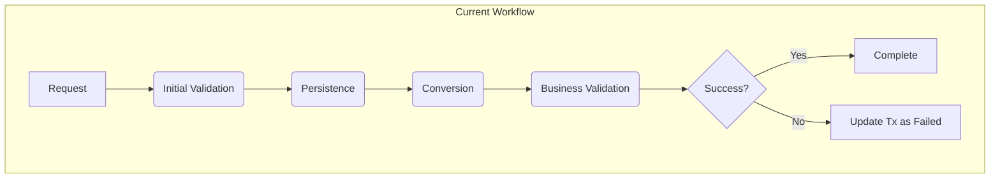
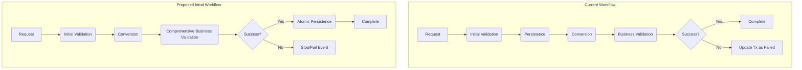

# 🏗️ Architecture Overview

This document outlines the event-driven architecture of the Fintech application, detailing the current implementation and a proposal for future refinement.

## 🧬 1. Current Event-Driven Architecture

The system is built on a robust, event-driven model to handle core financial flows like deposits, withdrawals, and transfers. This approach ensures that business logic is decoupled, scalable, and easy to maintain.

### 🧩 Core Concepts

- **Domain Events:** Plain Go structs that represent significant business occurrences (e.g., `DepositRequestedEvent`, `ConversionCompletedEvent`).
- **Event Bus:** A central component responsible for routing events to the appropriate handlers.
- **Handlers:** Functions that subscribe to specific events, execute a single piece of business logic, and may emit new events to continue the flow.

### ♟️ Conversion Handler: Strategy Pattern Refactor

A key part of the current architecture is the generic `ConversionHandler`. Previously, this handler contained a `switch` statement to determine which event to emit after a currency conversion. This was refactored to use the **Strategy Pattern**, providing greater flexibility and adhering to the Open/Closed Principle.

- **`EventFactory` Interface:** An interface that defines a single method, `CreateNextEvent`.
- **Concrete Factories:** Each business flow (`deposit`, `withdraw`, `transfer`) has its own factory that implements this interface (e.g., `DepositEventFactory`).
- **Handler Logic:** The `ConversionHandler` now takes a map of factories. Instead of a `switch`, it looks up the appropriate factory based on the event's `FlowType` and delegates the creation of the next event to it.

This design allows new flows to be added to the conversion process without modifying the core handler logic—only a new factory and its registration are needed.

### 🌊 Current Event Flow

The current flow generally follows a "Persist Early" model. A transaction record is created early in the process, and subsequent steps (like business validation) may update its status.

## 💡 2. Proposed Architectural Refinement: "Validate, Then Persist"

To further improve the system's robustness and simplify its logic, a future refactoring is proposed. The goal is to move from the "Persist Early" model to a "Validate, Then Persist" model.

### 🤔 Rationale

This model ensures that the system's state (the database) is only modified after all business rules have been successfully validated. This makes the entire flow more atomic and transactional from a business perspective. It eliminates the need for "failed" transaction records, as a transaction is only created when it is guaranteed to succeed.

### 🚀 Proposed Event Flow

In this model, all validation and conversion logic is completed *before* any persistence occurs.

1.  **Request → Initial Validation:** Basic, non-DB checks.
2.  **Validation → Conversion:** Currency conversion is performed.
3.  **Conversion → Comprehensive Business Validation:** A single, powerful handler checks all business rules (e.g., limits, fraud, account status) using the final, converted amount.
4.  **Validation Passed → Atomic Persistence:** A final handler performs a single database transaction to create the transaction record and update account balances.

### 📊 Visual Comparison

### ✅ Benefits of the Proposed Model

-   **Transactional Integrity:** Eliminates "failed" records. The database only stores the state of successful operations.
-   **Clearer Separation of Concerns:** Business logic is centralized in one handler, making it easier to manage and reason about.
-   **Reduced Complexity:** Removes the need for compensatory logic to handle late-stage failures. The flow is a linear path to either success or failure.
-   **Enhanced Idempotency:** It is easier to design idempotent handlers when the state-changing database write occurs in one final, predictable step.
