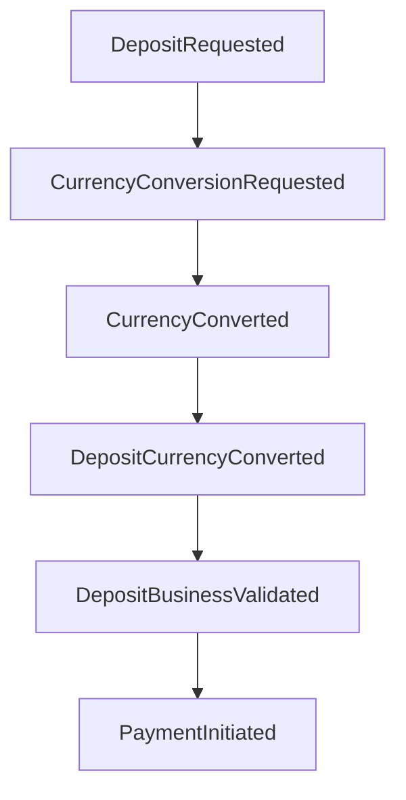
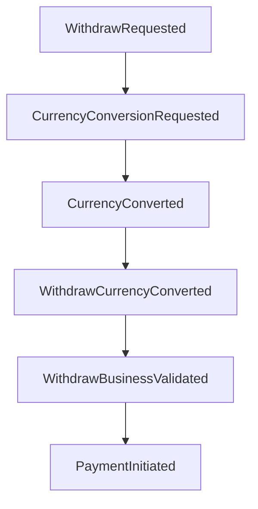
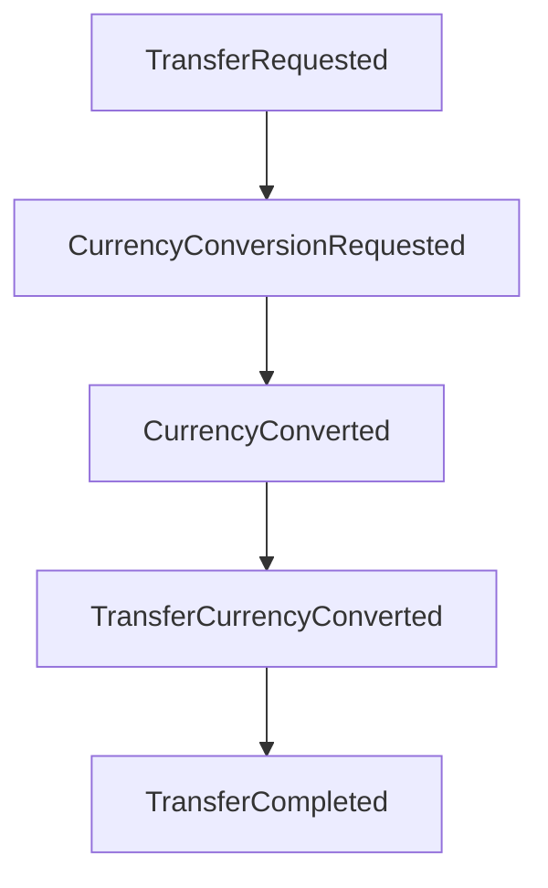

# 🏗️ Architecture Overview

This document outlines the event-driven architecture of the Fintech application, detailing the current implementation and design principles.

## 🧬 Current Event-Driven Architecture

The system is built on a robust, event-driven model to handle core financial flows like deposits, withdrawals, and transfers. This approach ensures that business logic is decoupled, scalable, and easy to maintain.

### 🧩 Core Concepts

- **Domain Events:** Plain Go structs that represent significant business occurrences (e.g., `DepositRequestedEvent`, `ConversionDoneEvent`).
- **Event Bus:** A central component responsible for routing events to the appropriate handlers.
- **Handlers:** Functions that subscribe to specific events, execute a single piece of business logic, and may emit new events to continue the flow.

### ♟️ Conversion Handler: Strategy Pattern Implementation

A key part of the current architecture is the generic `ConversionHandler`. This handler uses the **Strategy Pattern** to determine which event to emit after a currency conversion, providing flexibility and adhering to the Open/Closed Principle.

- **`EventFactory` Interface:** An interface that defines a single method, `CreateNextEvent`.
- **Concrete Factories:** Each business flow (`deposit`, `withdraw`, `transfer`) has its own factory that implements this interface (e.g., `DepositEventFactory`).
- **Handler Logic:** The `ConversionHandler` takes a map of factories. Instead of a `switch`, it looks up the appropriate factory based on the event's `FlowType` and delegates the creation of the next event to it.

This design allows new flows to be added to the conversion process without modifying the core handler logic—only a new factory and its registration are needed.

### 🌊 Current Event Flows

The system implements three main business flows:

#### Deposit Flow

#### Withdraw Flow

#### Transfer Flow

### 🏛️ Handler Responsibilities

Each handler in the system follows the Single Responsibility Principle:

1. **Validation Handlers:** Perform input validation and business rule checks
2. **HandleProcessed Handlers:** Handle database operations and transaction creation
3. **Business Validation Handlers:** Perform complex business logic validation
4. **Conversion Handlers:** Handle currency conversion operations
5. **Payment Handlers:** Integrate with external payment providers

### 🔄 Event Bus Pattern

The event bus implementation provides:

- **Type-safe event registration:** Handlers register for specific event types
- **Synchronous processing:** Events are processed immediately for consistency
- **Error handling:** Failed handlers can emit failure events or return errors
- **Logging integration:** All events are logged with correlation IDs for tracing

### 🧪 Testing Strategy

The architecture supports comprehensive testing:

- **Unit Tests:** Individual handlers tested in isolation with mocks
- **Integration Tests:** Full event chains tested end-to-end
- **E2E Tests:** Complete business flows verified with real event sequences
- **Static Analysis:** Automated cycle detection prevents infinite event loops

### 📊 Benefits of Current Architecture

- **Modularity:** Each handler is independent and can be developed/tested separately
- **Scalability:** New business flows can be added without modifying existing code
- **Maintainability:** Clear separation of concerns makes the codebase easy to understand
- **Testability:** Event-driven design enables comprehensive testing strategies
- **Traceability:** Correlation IDs and structured logging provide full audit trails

### 🔮 Future Considerations

While the current architecture is robust, potential improvements include:

- **Asynchronous Processing:** For high-throughput scenarios
- **Event Sourcing:** For complete audit trails and replay capabilities
- **CQRS Integration:** For read/write separation in complex scenarios
- **Distributed Events:** For microservice architectures

## 📚 Related Documentation

- [Domain Events](domain-events.md)
- [Event-Driven Payments](payments/event-driven-payments.md)
- [Service Domain Communication](service-domain-communication.md)
- [Testing Guide](testing.md)
