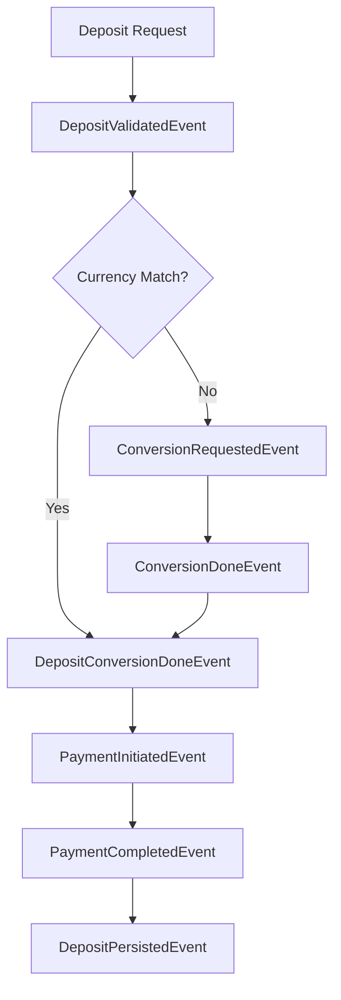

# Architecture Overview 🏗️

## Overview

Our fintech application follows a sophisticated **event-driven, clean architecture** designed for multi-currency financial operations. The architecture emphasizes separation of concerns, testability, and scalability while maintaining clean business logic.

## Core Architecture Principles

### 1. Event-Driven Design 🔄

- **Events as First-Class Citizens**: All business operations emit events
- **Event Chaining**: Dependent operations flow through events
- **Decoupled Handlers**: Each handler has a single responsibility
- **No If-Statements for Control Flow**: Event chaining eliminates conditional logic

### 2. Clean Architecture 🏛️

- **Domain-Driven Design**: Business logic in domain layer
- **Dependency Inversion**: Depend on abstractions, not concretions
- **Separation of Concerns**: Clear boundaries between layers
- **Repository Pattern**: Data access abstraction

### 3. Multi-Currency Support 💱

- **Currency Conversion**: Pure, reusable service with no side effects
- **Business Validation**: Always performed after conversion in account's native currency
- **Payment Processing**: Triggered by business validation, not conversion
- **Flexible Payment Triggers**: Different operations can trigger payment independently

### 4. Testing Excellence 🧪

- **Unit Tests**: Each component tested in isolation
- **Integration Tests**: End-to-end event flow testing
- **Mock Dependencies**: Easy to mock external services
- **Event-Driven Testing**: Test event flows and handler interactions

## Architecture Layers

```
┌─────────────────────────────────────────────────────────────┐
│                    Presentation Layer                       │
│  ┌─────────────┐  ┌─────────────┐  ┌─────────────┐        │
│  │   HTTP API  │  │   CLI App   │  │   Webhooks  │        │
│  └─────────────┘  └─────────────┘  └─────────────┘        │
└─────────────────────────────────────────────────────────────┘
                              │
┌─────────────────────────────────────────────────────────────┐
│                    Application Layer                        │
│  ┌─────────────┐  ┌─────────────┐  ┌─────────────┐        │
│  │ Event Bus   │  │ Event       │  │ Command/    │        │
│  │             │  │ Handlers    │  │ Query       │        │
│  └─────────────┘  └─────────────┘  └─────────────┘        │
└─────────────────────────────────────────────────────────────┘
                              │
┌─────────────────────────────────────────────────────────────┐
│                     Domain Layer                            │
│  ┌─────────────┐  ┌─────────────┐  ┌─────────────┐        │
│  │   Entities  │  │   Services  │  │   Events    │        │
│  │             │  │             │  │             │        │
│  └─────────────┘  └─────────────┘  └─────────────┘        │
└─────────────────────────────────────────────────────────────┘
                              │
┌─────────────────────────────────────────────────────────────┐
│                  Infrastructure Layer                       │
│  ┌─────────────┐  ┌─────────────┐  ┌─────────────┐        │
│  │ Repositories│  │ External    │  │   Cache     │        │
│  │ (with UoW)  │  │ Services    │  │             │        │
│  └─────────────┘  └─────────────┘  └─────────────┘        │
└─────────────────────────────────────────────────────────────┘
```

## Event-Driven Flow

### Deposit Flow Example



### Key Design Decisions

#### 1. Decoupled Currency Conversion

**Problem**: Original design coupled currency conversion with payment initiation.

**Solution**: Currency conversion is now a pure, reusable service:

- Emits generic `ConversionRequestedEvent` and `ConversionDoneEvent`
- Has no business logic or side effects
- Can be used by any business operation
- Doesn't trigger payment processing

**Benefits**:

- Reusable across all operations (deposit, withdraw, transfer)
- Easier to test and mock
- No code duplication
- Clear separation of concerns

#### 2. Business Validation After Conversion

**Problem**: Business invariants were sometimes checked before currency conversion.

**Solution**: All business validations performed after conversion:

- Sufficient funds check in account's native currency
- Maximum/minimum limits in account's native currency
- All business rules applied to converted amounts

**Benefits**:

- Accurate validation regardless of request currency
- Consistent business rule enforcement
- No currency-related validation bugs
- Clear audit trail of validation in correct currency

#### 3. Payment Triggered by Business Validation

**Problem**: Payment was triggered by conversion completion, not business validation.

**Solution**: Payment initiation triggered by business validation events:

- `WithdrawValidatedEvent` triggers payment for withdrawals
- `DepositValidatedEvent` triggers payment for deposits
- Business validation ensures all rules pass before payment

**Benefits**:

- Payment only occurs after all validations pass
- Clear audit trail of validation → payment flow
- Easier to add new payment triggers
- Better error handling and rollback capabilities

## Key Components

### 1. Event Bus

- **Purpose**: Central event dispatching mechanism
- **Features**: Async event processing, handler registration
- **Implementation**: In-memory event bus with extensible design

### 2. Event Handlers

- **Generic Handlers**: Reusable logic (e.g., currency conversion)
- **Business-Specific Handlers**: Context-aware operations
- **Pattern**: Dependency injection with structured logging

### 3. Domain Services

- **Account Service**: Account operations and validation
- **Currency Service**: Currency conversion and validation
- **Payment Service**: Payment processing and integration

### 4. Repositories

- **Unit of Work Pattern**: Transactional consistency
- **Repository Pattern**: Data access abstraction
- **CQRS**: Separated read and write operations

### 5. Infrastructure

- **External Services**: Payment providers, exchange rate APIs
- **Caching**: Redis and in-memory caching
- **Database**: PostgreSQL with migrations

## Benefits Achieved

### 1. Maintainability

- Clear separation of concerns
- Each handler has a single responsibility
- Easy to modify individual components
- Well-documented architecture

### 2. Testability

- Each component can be tested in isolation
- Mock dependencies easily injected
- Event-driven testing patterns
- Clear test boundaries

### 3. Scalability

- Handlers can be scaled independently
- Event bus can be distributed
- Easy to add new business operations
- No tight coupling

### 4. Flexibility

- New currencies can be added without changing business logic
- New payment providers can be integrated easily
- Business rules can be modified independently
- Clear extension points

### 5. Observability

- Clear event flow for debugging
- Structured logging at each step
- Audit trail of all operations
- Easy to monitor and alert

## Technology Stack

### Core Framework

- **Go**: Primary programming language
- **Fiber**: Web framework for HTTP API
- **GORM**: ORM for database operations

### Event-Driven

- **Custom Event Bus**: In-memory event dispatching
- **Event Chaining**: Sequential event processing
- **Handler Registry**: Dynamic handler registration

### Database & Storage

- **PostgreSQL**: Primary database
- **Redis**: Caching and session storage
- **Migrations**: Database schema management

### External Services

- **Stripe**: Payment processing
- **Exchange Rate APIs**: Currency conversion
- **Mock Providers**: Testing and development

### Testing & Quality

- **Testify**: Testing framework
- **Mockery**: Mock generation
- **Testifylint**: Linting for tests

## Architecture Patterns

### 1. Event-Driven Architecture

- **Events**: Business events as first-class citizens
- **Event Chaining**: Sequential event processing
- **Handler Registry**: Dynamic handler registration

### 2. Clean Architecture

- **Domain Layer**: Business logic and entities
- **Application Layer**: Use cases and orchestration
- **Infrastructure Layer**: External concerns

### 3. Repository Pattern

- **Unit of Work**: Transactional consistency
- **Repository Interface**: Data access abstraction
- **CQRS**: Separated read and write operations

### 4. Dependency Injection

- **Constructor Injection**: Dependencies injected at creation
- **Interface-Based**: Depend on abstractions
- **Testable**: Easy to mock dependencies

### 5. Decorator Pattern

- **Cross-Cutting Concerns**: Logging, caching, validation
- **Composable**: Easy to add new decorators
- **Testable**: Each decorator can be tested independently

## Migration Strategy

### Phase 1: Foundation

1. Implement clean architecture principles
2. Add dependency injection
3. Introduce repository pattern with Unit of Work

### Phase 2: Event-Driven

1. Implement event bus
2. Create event-driven handlers
3. Add event chaining patterns

### Phase 3: Multi-Currency

1. Implement currency conversion service
2. Add multi-currency validation
3. Decouple conversion from payment

### Phase 4: Optimization

1. Implement CQRS for transactions
2. Add caching and performance optimizations
3. Improve error handling and observability

## Final Architecture Summary

Our final architecture is a **sophisticated event-driven, multi-currency financial system** that:

- ✅ **Decouples concerns** through event-driven design
- ✅ **Handles multi-currency** operations correctly
- ✅ **Maintains consistency** through Unit of Work pattern
- ✅ **Scales effectively** through clean separation
- ✅ **Tests thoroughly** through dependency injection
- ✅ **Observes clearly** through structured logging

This architecture provides a solid foundation for future growth while maintaining clean separation of concerns and enabling easy extension of business operations.

## Next Steps

1. **Monitor Performance**: Track system performance and optimize as needed
2. **Add New Features**: Use established patterns for new business operations
3. **Improve Observability**: Add metrics, tracing, and alerting
4. **Scale Infrastructure**: Consider distributed event bus for high load
5. **Document Patterns**: Continue documenting best practices and patterns

The architecture has evolved from a simple layered application to a sophisticated, event-driven, multi-currency financial system that is maintainable, testable, scalable, and flexible.
