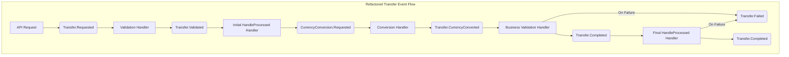

# ⚡ Event-Driven Transfer Flow (Current Architecture)

## 🏁 Overview

The current transfer process is a fully event-driven, linear workflow. Each business step is handled by a dedicated, single-responsibility handler with defensive validation. This design ensures modularity, testability, and a clear, robust separation of concerns, preventing unintended side effects like accidental payment initiation.

---

## 🖼️ Event Flow Diagram

---

## 🧩 Event Handler Responsibilities

### 1. **Validation Handler**

- **Consumes:** `Transfer.Requested`
- **Responsibility:** Performs basic structural validation on the request (e.g., non-nil UUIDs, positive amount). Malformed events are logged and discarded.
- **Emits:** `Transfer.Validated` on success.

### 2. **Initial HandleProcessed Handler**

- **Consumes:** `Transfer.Validated`
- **Responsibility:** Creates the initial outgoing transaction (`tx_out`) with a `pending` status. This provides a durable record of the request early.
- **Emits:** `CurrencyConversion.Requested` to trigger currency conversion (if needed).

### 3. **Conversion Handler (Generic)**

- **Consumes:** `CurrencyConversion.Requested`
- **Responsibility:** Performs currency conversion.
- **Emits:** `Transfer.CurrencyConverted` (a context-specific event).

### 4. **Business Validation Handler**

- **Consumes:** `Transfer.CurrencyConverted`
- **Responsibility:** Performs all business-level validation against the current state of the system (e.g., sufficient funds in the source account).
- **Emits:**
  - `Transfer.Completed` on success.
  - `Transfer.Failed` on business rule failure (e.g., insufficient funds).

### 5. **Final HandleProcessed Handler**

- **Consumes:** `Transfer.Completed`
- **Responsibility:** Atomically performs the final state changes:
  - Creates the incoming transaction (`tx_in`) for the receiver with a `completed` status.
  - Updates the outgoing transaction (`tx_out`) to `completed`.
  - Updates the balances of both the source and destination accounts.
- **Emits:**
  - `Transfer.Completed` on success.
  - `Transfer.Failed` if the atomic database operation fails.
