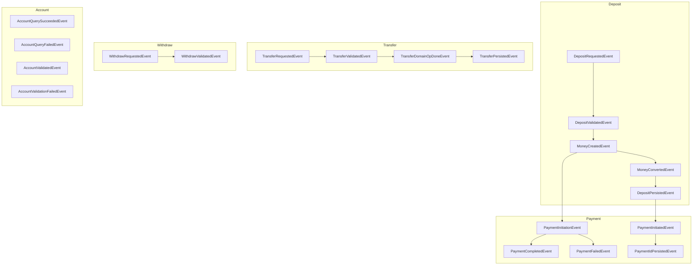

# 📡 Domain Events in Fintech

> **Event-driven architecture: decoupling business logic with domain events**

## 🏁 Overview

Domain events are immutable messages that represent significant business occurrences within the system. In this fintech project, domain events are the backbone of the event-driven architecture, enabling modular, decoupled, and extensible workflows for payments, transfers, deposits, withdrawals, and account operations.

## 🧩 Key Domain Events

Events are defined in [`pkg/domain/account/events/`](https://github.com/amirasaad/fintech/pkg/domain/account/events/):

- **Deposit Events:**
  - `DepositRequestedEvent`
  - `DepositValidatedEvent`
  - `MoneyCreatedEvent`
  - `MoneyConvertedEvent`
  - `DepositPersistedEvent`
- **Payment Events:**
  - `PaymentInitiationEvent`
  - `PaymentCompletedEvent`
  - `PaymentFailedEvent`
  - `PaymentInitiatedEvent`
  - `PaymentIdPersistedEvent`
- **Transfer Events:**
  - `TransferRequestedEvent`
  - `TransferValidatedEvent`
  - `TransferDomainOpDoneEvent`
  - `TransferPersistedEvent`
- **Withdraw Events:**
  - `WithdrawRequestedEvent`
  - `WithdrawValidatedEvent`
- **Account Events:**
  - `AccountQuerySucceededEvent`
  - `AccountQueryFailedEvent`
  - `AccountValidatedEvent`
  - `AccountValidationFailedEvent`

## 🖼️ Event Relationships

## 🛠️ Best Practices

- **Immutability:** Events should never be mutated after creation.
- **Explicit Event Types:** Use clear, descriptive event type names (see `EventType()` methods).
- **Decoupling:** Business logic should be implemented in event handlers, not in the event emitters.
- **Extensibility:** Add new events for new business flows; subscribe handlers as needed.

## 📚 References

- [Event-Driven Payments](payments/event-driven-payments.md)
- [Event-Driven Stripe Webhook](payments/event-driven-stripe-webhook.md)
- [EventBus Implementation](https://github.com/amirasaad/fintech/pkg/eventbus/)
- [Payment Handlers](https://github.com/amirasaad/fintech/pkg/handler/payment/)
- [Domain Event Definitions](https://github.com/amirasaad/fintech/pkg/domain/account/events/)
