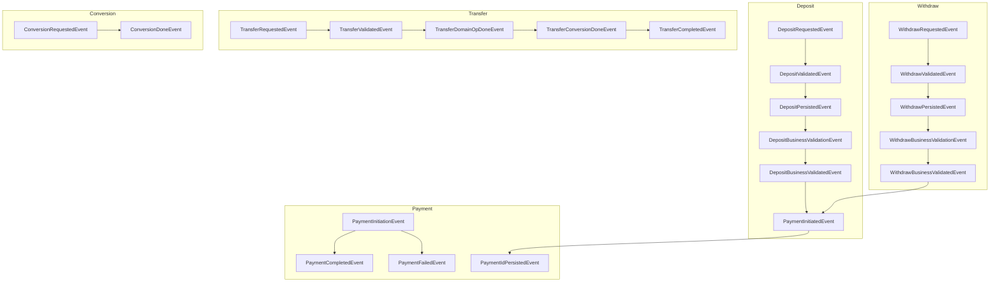

# 📡 Domain Events in Fintech

> **Event-driven architecture: decoupling business logic with domain events**

## 🏁 Overview

Domain events are immutable messages that represent significant business occurrences within the system. In this fintech project, domain events are the backbone of the event-driven architecture, enabling modular, decoupled, and extensible workflows for payments, transfers, deposits, withdrawals, and account operations.

## 🧩 Key Domain Events

Events are defined in [`pkg/domain/events/`](../pkg/domain/events/):

### Deposit Events
- `DepositRequestedEvent` - Initial deposit request
- `DepositValidatedEvent` - Deposit validation completed
- `DepositPersistedEvent` - Deposit transaction persisted
- `DepositBusinessValidationEvent` - Business validation after conversion
- `DepositBusinessValidatedEvent` - Business validation completed

### Withdraw Events
- `WithdrawRequestedEvent` - Initial withdraw request
- `WithdrawValidatedEvent` - Withdraw validation completed
- `WithdrawPersistedEvent` - Withdraw transaction persisted
- `WithdrawBusinessValidationEvent` - Business validation after conversion
- `WithdrawBusinessValidatedEvent` - Business validation completed
- `WithdrawFailedEvent` - Withdraw operation failed

### Transfer Events
- `TransferRequestedEvent` - Initial transfer request
- `TransferValidatedEvent` - Transfer validation completed
- `TransferBusinessValidatedEvent` - Transfer conversion completed
- `TransferDomainOpDoneEvent` - Transfer domain operation completed
- `TransferPersistedEvent` - Transfer persistence completed
- `TransferCompletedEvent` - Transfer fully completed
- `TransferFailedEvent` - Transfer operation failed

### Payment Events
- `PaymentInitiationEvent` - Payment initiation request
- `PaymentInitiatedEvent` - Payment initiated with provider
- `PaymentCompletedEvent` - Payment confirmed by provider
- `PaymentFailedEvent` - Payment failed
- `PaymentIdPersistedEvent` - Payment ID persisted to transaction

### Conversion Events
- `ConversionRequestedEvent` - Currency conversion requested
- `ConversionDoneEvent` - Currency conversion completed

## 🖼️ Event Flow Relationships



## 🏗️ Event Structure

All events follow a consistent structure:

### Common FlowEvent
```go
type FlowEvent struct {
    FlowType      string    // "deposit", "withdraw", "transfer"
    UserID        uuid.UUID
    AccountID     uuid.UUID
    CorrelationID uuid.UUID
}
```

### Event Interface
```go
type Event interface {
    Type() string
}
```

## 🛠️ Best Practices

- **Immutability:** Events should never be mutated after creation.
- **Explicit Event Types:** Use clear, descriptive event type names (see `Type()` methods).
- **Decoupling:** Business logic should be implemented in event handlers, not in the event emitters.
- **Extensibility:** Add new events for new business flows; subscribe handlers as needed.
- **Correlation IDs:** All events include correlation IDs for tracing across the entire flow.
- **Structured Logging:** All handlers use emoji-rich structured logging for clarity.

## 🧪 Testing

- **E2E Event Flow Tests:** Verify complete event chains for each business flow
- **Unit Tests:** Test individual event handlers in isolation
- **Mock Integration:** Use testify mocks for repository and external service interactions
- **Static Analysis:** Automated cycle detection prevents infinite event loops

## 📚 References

- [Event-Driven Architecture](architecture.md)
- [Event-Driven Payments](payments/event-driven-payments.md)
- [Event-Driven Stripe Webhook](payments/event-driven-stripe-webhook.md)
- [EventBus Implementation](../pkg/eventbus/)
- [Payment Handlers](../pkg/handler/payment/)
- [Domain Event Definitions](../pkg/domain/events/)
