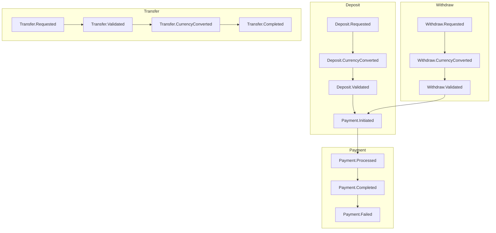

# 📡 Domain Events in Fintech

> **Event-driven architecture: decoupling business logic with domain events**

## 🏁 Overview

Domain events are immutable messages that represent significant business occurrences within the system. In this fintech project, domain events are the backbone of the event-driven architecture, enabling modular, decoupled, and extensible workflows for payments, transfers, deposits, withdrawals, and account operations.

### 🔑 Key Principles

1. **Immutable**: Events are records of things that happened in the past
2. **Self-Contained**: Each event carries all necessary data
3. **Named in Past Tense**: Events represent something that has already occurred
4. **Causality**: Events form a directed acyclic graph (DAG)
5. **Idempotency**: Event handling must be idempotent

### 🏗️ Event Structure

All domain events implement the following interface:

```go
type Event interface {

    Type() string // Event type
```

### 🌐 Event Bus

Events are published to an event bus that routes them to registered handlers:

```go
type EventBus interface {
    Emit(ctx context.Context, event Event) error
    Register(eventType string, handler EventHandler) error
}
```

### 📊 Event Store

All events are persisted in an event store for audit and replay:

```go
type EventStore interface {
    Save(events []Event) error
    Load(aggregateID string) ([]Event, error)
    Subscribe(handler EventHandler) error
}
```

## 🧩 Key Domain Events

Events are defined in [`pkg/domain/events/`](../pkg/domain/events/):

### Deposit Flow

- `Deposit.Requested` - Initial deposit request
- `Deposit.CurrencyConverted` - Input validation completed
- `Deposit.Validated` - Deposit record created in database
- `Payment.Initiated` - Payment processing started with provider

### Withdraw Flow

- `Withdraw.Requested` - Initial withdraw request
- `Withdraw.CurrencyConverted` - Input validation completed
- `Withdraw.Validated` - Withdraw record created in database
- `Payment.Initiated` - Payment processing started with provider

### Transfer Flow

- `Transfer.Requested` - Initial transfer request
- `Transfer.CurrencyConverted` - Input validation completed
- `Transfer.Validated` - Transfer record created in database
- `Transfer.Completed` - Transfer fully completed

### Payment Events

- `Payment.Initiated` - Payment processing started with provider
- `Payment.Processed` - Payment processed by webhook
- `Payment.Completed` - Payment confirmed by provider
- `Payment.Failed` - Payment processing failed

### Common Events

- `AccountBalanceUpdatedEvent` - Account balance was updated
- `TransactionCreatedEvent` - New transaction was created

## 🖼️ Event Flow Relationships



### Common FlowEvent

```go
type FlowEvent struct {
    FlowType      string    // "deposit", "withdraw", "transfer", "payment", "payment"
    UserID        uuid.UUID
    AccountID     uuid.UUID
    CorrelationID uuid.UUID
    Timestamp     time.Time
}
```

### Event Interface

```go
type Event interface {
    Type() string
}
```

## 🛠️ Best Practices

- **Immutability:** Events should never be mutated after creation.
- **Explicit Event Types:** Use clear, descriptive event type names (see `Type()` methods).
- **Decoupling:** Business logic should be implemented in event handlers, not in the event emitters.
- **Extensibility:** Add new events for new business flows; subscribe handlers as needed.
- **Correlation IDs:** All events include correlation IDs for tracing across the entire flow.
- **Structured Logging:** All handlers use emoji-rich structured logging for clarity.

## 🧪 Testing

- **E2E Event Flow Tests:** Verify complete event chains for each business flow
- **Unit Tests:** Test individual event handlers in isolation
- **Mock Integration:** Use testify mocks for repository and external service interactions
- **Static Analysis:** Automated cycle detection prevents infinite event loops

## 📚 References

- [Event-Driven Architecture](architecture.md)
- [Event-Driven Payments](payments/event-driven-payments.md)
- [Event-Driven Stripe Webhook](payments/event-driven-stripe-webhook.md)
- [EventBus Implementation](../pkg/eventbus/)
- [Payment Handlers](../pkg/handler/payment/)
- [Domain Event Definitions](../pkg/domain/events/)
