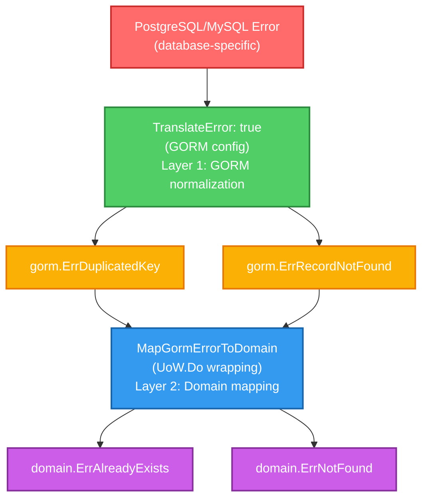

# Error Handling

This document describes the error handling strategy in the fintech application, focusing on how database errors are translated to domain errors.

## Overview

The application uses a **two-layer error translation approach** to ensure:

1. Database-agnostic error handling (works with PostgreSQL, MySQL, etc.)
2. Clean separation between infrastructure and domain layers
3. Consistent error types throughout the application

## Error Translation Flow



## Implementation

### Layer 1: GORM Error Translation

Configured in `infra/database.go`:

```go
connection, err := gorm.Open(postgres.Open(databaseUrl), &gorm.Config{
    // TranslateError normalizes database-specific errors into GORM generic errors
    // This ensures database-agnostic error handling
    TranslateError: true,
})
```

**What it does:**

- Converts PostgreSQL errors (e.g., `"duplicate key value violates unique constraint"`) → `gorm.ErrDuplicatedKey`
- Converts MySQL errors → Same GORM errors
- Makes error handling consistent across different databases

### Layer 2: Domain Error Mapping

Implemented in `infra/repository/errors.go`:

```go
// MapGormErrorToDomain converts GORM errors to domain errors
func MapGormErrorToDomain(err error) error {
    // Traverses error chain to find GORM errors
    // Maps gorm.ErrDuplicatedKey → domain.ErrAlreadyExists
    // Maps gorm.ErrRecordNotFound → domain.ErrNotFound
}
```

**Current mappings:**

- `gorm.ErrDuplicatedKey` → `domain.ErrAlreadyExists`
- `gorm.ErrRecordNotFound` → `domain.ErrNotFound`

### Automatic Error Mapping

**Transaction Operations (UoW.Do):**

All operations within `UoW.Do()` automatically get error mapping:

```go
// infra/repository/uow.go
func (u *UoW) Do(ctx context.Context, fn func(uow repository.UnitOfWork) error) error {
    return WrapError(func() error {
        return u.db.WithContext(ctx).Transaction(func(tx *gorm.DB) error {
            // All errors from fn() are automatically mapped
            return fn(txnUow)
        })
    })
}
```

**Benefits:**

- ✅ **No repository changes needed** - All transactional operations get automatic mapping
- ✅ **Consistent error handling** - All errors go through the same translation layer
- ✅ **Clean architecture** - Infrastructure concerns stay in infrastructure layer

## Usage Examples

### In Services (Using UoW)

```go
func (s *AccountService) Deposit(...) error {
    // Errors are automatically mapped in UoW.Do()
    return s.uow.Do(ctx, func(uow repository.UnitOfWork) error {
        accountRepo, _ := uow.AccountRepository()
        // Any GORM errors are automatically mapped to domain errors
        return accountRepo.Create(account)
    })
}
```

### In Repositories (Outside UoW)

For operations that don't use `UoW.Do()`, use the `WrapError` helper:

```go
// Option 1: Using WrapError helper
func (r *repository) Create(ctx context.Context, create *dto.UserCreate) error {
    return WrapError(func() error {
        return r.db.WithContext(ctx).Create(user).Error
    })
}

// Option 2: Direct mapping
func (r *repository) Create(ctx context.Context, create *dto.UserCreate) error {
    err := r.db.WithContext(ctx).Create(user).Error
    return MapGormErrorToDomain(err)
}
```

### In API Handlers

Domain errors are automatically converted to appropriate HTTP status codes:

```go
// webapi/common/utils.go
func errorToStatusCode(err error) int {
    switch {
    case errors.Is(err, domain.ErrAlreadyExists):
        return fiber.StatusUnprocessableEntity  // 422
    case errors.Is(err, domain.ErrNotFound):
        return fiber.StatusNotFound  // 404
    // ... more mappings
    }
}
```

**Example response:**

```json
{
  "type": "about:blank",
  "title": "Unprocessable Entity",
  "status": 422,
  "detail": "Unprocessable entity"
}
```

## Error Mapping Reference

### Current Mappings

| GORM Error | Domain Error | HTTP Status |
|------------|--------------|-------------|
| `gorm.ErrDuplicatedKey` | `domain.ErrAlreadyExists` | 422 Unprocessable Entity |
| `gorm.ErrRecordNotFound` | `domain.ErrNotFound` | 404 Not Found |

### Adding New Mappings

To add new error mappings:

1. **Add mapping in `infra/repository/errors.go`:**

```go
func MapGormErrorToDomain(err error) error {
    // ...
    switch {
    case errors.Is(currentErr, gorm.ErrDuplicatedKey):
        return domain.ErrAlreadyExists
    case errors.Is(currentErr, gorm.ErrRecordNotFound):
        return domain.ErrNotFound
    case errors.Is(currentErr, gorm.ErrForeignKeyViolated):
        return domain.ErrInvalidReference  // New mapping
    }
}
```

2. **Add HTTP status mapping in `webapi/common/utils.go`:**

```go
func errorToStatusCode(err error) int {
    switch {
    case errors.Is(err, domain.ErrInvalidReference):
        return fiber.StatusBadRequest  // 400
    }
}
```

3. **Add domain error in `pkg/domain/errors.go` (if needed):**

```go
var (
    ErrInvalidReference = errors.New("invalid reference")
)
```

## Best Practices

1. **Always use UoW.Do() for transactional operations** - Gets automatic error mapping
2. **Use WrapError() for non-transactional repository methods** - Ensures consistency
3. **Never expose GORM errors directly** - Always map to domain errors first
4. **Keep infrastructure concerns in infrastructure layer** - Error mapping belongs in `infra/repository`
5. **Use domain errors for business logic** - Services should work with domain errors, not GORM errors

## Testing

Error mapping is fully tested in `infra/repository/errors_test.go`:

- ✅ Direct GORM error mapping
- ✅ Error chain traversal
- ✅ Wrapped error handling
- ✅ Unmapped error passthrough

Run tests:

```bash
go test ./infra/repository -run TestMapGormErrorToDomain
```

## Related Files

- Error mapping implementation: `infra/repository/errors.go`
- Error mapping tests: `infra/repository/errors_test.go`
- UoW error mapping: `infra/repository/uow.go`
- GORM configuration: `infra/database.go`
- HTTP error mapping: `webapi/common/utils.go`
- Domain errors: `pkg/domain/errors.go`
