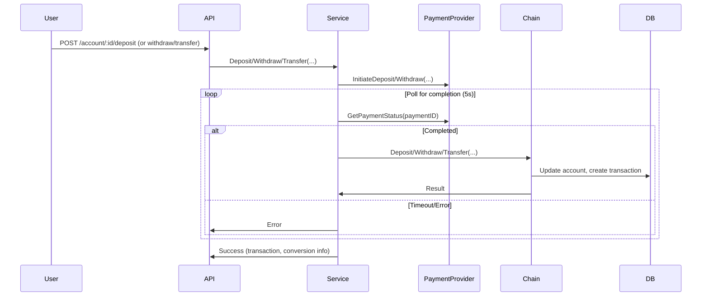

# Current Payment Flow (Synchronous/Polling)

This section documents the current payment flow for deposit, withdraw, and transfer operations in the system. The flow is synchronous and relies on polling the payment provider for completion before proceeding with business logic and persistence.

## Flow Description

1. **API Request**
   - User sends a request to deposit, withdraw, or transfer funds via the API (`/account/:id/deposit`, `/account/:id/withdraw`, `/account/:id/transfer`).
   - The Fiber handler parses and validates the request, then calls the corresponding method on the `account.Service`.

2. **Service Layer**
   - The service method (`Deposit`, `Withdraw`, `Transfer`) initiates the payment with the (mock) payment provider.
   - For deposits/withdrawals, the service **polls** the payment provider for up to 5 seconds, checking if the payment is completed.
       - If the payment is not completed in time, it returns an error.
       - If completed, it proceeds to the next step.

3. **Business Logic (Chain of Responsibility)**
   - The service calls the `accountChain` (chain of responsibility pattern) to perform the business operation:
       - **Validation**: Checks account/user validity.
       - **Money Creation**: Constructs the money value object.
       - **Currency Conversion**: Converts currency if needed.
       - **Domain Operation**: Executes the deposit/withdraw/transfer on the domain model.
       - **Persistence**: Updates the account and creates the transaction in the database.

4. **API Response**
   - The handler serializes the transaction and conversion info (if any) and returns a success response to the client.

## Mermaid Diagram: Current Payment Flow

## Event-Driven Payment Flow Migration

## Overview

This document describes the migration from a synchronous, polling-based payment confirmation model to an event-driven, webhook-based architecture for deposit and withdrawal operations.

### Why Event-Driven?

- **Scalability:** Decouples user requests from payment processing, allowing for long-running or delayed confirmations.
- **Realism:** Matches how real payment providers (Stripe, banks, etc.) operate.
- **Resilience:** Enables retries, error handling, and user notification on payment status changes.
- **Observability:** All state changes are explicit and traceable.

## High-Level Architecture

1. **User initiates deposit/withdrawal.**
   - System creates a transaction with status `pending`.
   - Returns immediately to the user (no blocking or polling).
2. **Payment provider processes the payment.**
   - When done, it sends a webhook/callback to your service.
3. **Webhook handler receives confirmation.**
   - Updates the transaction status to `completed` or `failed`.
   - Triggers business logic (e.g., credit/debit account, notify user).
4. **User/client can poll or subscribe for status updates.**

## Transaction Lifecycle

- **pending:** Payment initiated, awaiting confirmation.
- **completed:** Payment confirmed by provider, funds credited/debited.
- **failed:** Payment failed or was rejected by provider.

## Endpoints

- **POST /account/:id/deposit**
  - Initiates a deposit, creates a `pending` transaction.
  - Returns transaction ID and status.

- **POST /account/:id/withdraw**
  - Initiates a withdrawal, creates a `pending` transaction.
  - Returns transaction ID and status.

- **POST /webhook/payment**
  - Receives payment provider webhook/callback.
  - Validates and updates transaction status.
  - Triggers business logic (credit/debit, notification).

- **GET /transaction/:id/status** (optional)
  - Returns current status of a transaction for polling clients.

## Migration Plan

1. **Add `status` field to transaction model and database.**
2. **Refactor service methods to create `pending` transactions and return immediately.**
3. **Implement webhook/callback endpoint for payment confirmation.**
4. **Update business logic to process status changes asynchronously.**
5. **Update tests and mocks to simulate webhook/callbacks.**
6. **Document new flow for team and clients.**

## Testing and Observability

- **Unit tests:** Cover all transaction state transitions and error cases.
- **Integration/E2E tests:** Simulate full payment flow, including webhook delivery.
- **Logging:** Log all state changes, webhook receipts, and errors.
- **Tracing:** Use OpenTelemetry to trace payment initiation, webhook handling, and status updates.
- **Metrics:** Track transaction counts, status transitions, webhook latency, and error rates.

## Best Practices

- **Webhook Security:** Validate signatures, use HTTPS, and ensure idempotency.
- **Error Handling:** Implement retries and dead-letter queues for failed webhooks.
- **Extensibility:** Design for multiple payment providers and future event types.
- **User Notification:** Optionally notify users on status changes (email, websocket, etc.).
- **Documentation:** Keep this doc and API references up to date as the system evolves.

---

_This document is a living guide. Update as the migration progresses and new requirements emerge._
