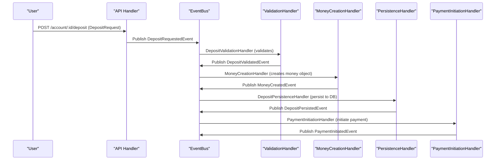

# :octicons-sync-24: Event-Driven Deposit Flow

This document describes the new event-driven architecture for the deposit workflow in the fintech system.

---

## Overview

The deposit process is now fully event-driven, with each business step handled by a dedicated event handler. This enables modularity, testability, and clear separation of concerns.

---

## Sequence Diagram

---

## Step-by-Step Flow

1. **User** submits a deposit via the API (`POST /account/:id/deposit`).
2. **API Handler** publishes a `DepositRequestedEvent` to the **EventBus**.
3. **DepositValidationHandler** validates the request and publishes `DepositValidatedEvent`.
4. **MoneyCreationHandler** creates the money object and publishes `MoneyCreatedEvent`.
5. **DepositPersistenceHandler** persists the deposit to the database and publishes `DepositPersistedEvent`.
6. **PaymentInitiationHandler** initiates the payment with the provider and publishes `PaymentInitiatedEvent`.
7. (Further domain operation and completion events can follow as needed.)

---

## Benefits

- **Decoupled:** Each step is handled by a dedicated event handler.
- **Testable:** Handlers can be unit tested in isolation.
- **Extensible:** New steps or business logic can be added by introducing new events and handlers.
- **Observable:** Each event can be logged, audited, or monitored independently.

---

:octicons-info-24: For more on event-driven patterns, see [docs/payments/event-driven-payments.md](event-driven-payments.md)
