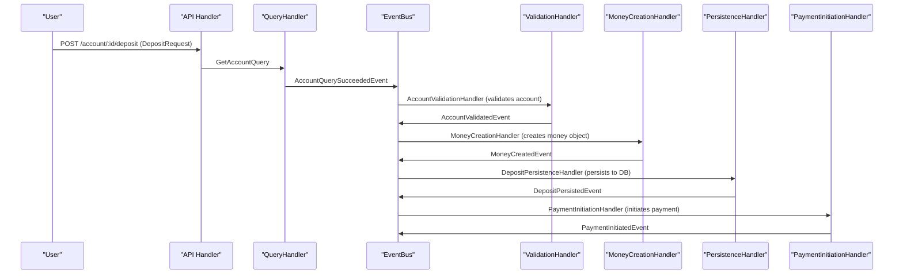

# :octicons-sync-24: Event-Driven Deposit Flow

This document describes the new event-driven architecture for the deposit workflow in the fintech system.

---

## Overview

The deposit process is now fully event-driven, with each business step handled by a dedicated event handler. This enables modularity, testability, and clear separation of concerns.

---

## Sequence Diagram



---

## Event-Driven Components

### 1. Query Handler
- **Purpose:** Retrieves account data and emits query events
- **Events Emitted:**
  - `AccountQuerySucceededEvent` - When account is found and authorized
  - `AccountQueryFailedEvent` - When query fails (not found, unauthorized, etc.)
- **Benefits:** Clean separation of data retrieval from business logic

### 2. Validation Handler
- **Purpose:** Performs business validation on retrieved accounts
- **Events Consumed:** `AccountQuerySucceededEvent`
- **Events Emitted:**
  - `AccountValidatedEvent` - When validation passes
  - `AccountValidationFailedEvent` - When validation fails
- **Validation Rules:**
  - Account exists and belongs to user
  - Account has valid ID
  - Account is in valid state for operations

### 3. Money Creation Handler
- **Purpose:** Creates money objects for the deposit
- **Events Consumed:** `AccountValidatedEvent`
- **Events Emitted:** `MoneyCreatedEvent`

### 4. Persistence Handler
- **Purpose:** Persists the deposit transaction to the database
- **Events Consumed:** `MoneyCreatedEvent`
- **Events Emitted:** `DepositPersistedEvent`

### 5. Payment Initiation Handler
- **Purpose:** Initiates payment with external providers
- **Events Consumed:** `DepositPersistedEvent`
- **Events Emitted:** `PaymentInitiatedEvent`

---

## Key Benefits

### 1. **Modularity**
Each handler has a single responsibility and can be developed, tested, and deployed independently.

### 2. **Testability**
- Unit tests for each handler
- Integration tests for event flows
- Easy mocking of dependencies

### 3. **Scalability**
- Handlers can be scaled independently
- Event-driven architecture supports async processing
- Easy to add new handlers without modifying existing code

### 4. **Maintainability**
- Clear separation of concerns
- Easy to understand and modify individual components
- Consistent patterns across all handlers

### 5. **Event Sourcing Ready**
- All business events are captured
- Easy to implement event sourcing patterns
- Audit trail of all operations

---

## Implementation Details

### Query Handler Pattern
```go
// Query handler emits events directly
func (h *getAccountQueryHandler) HandleQuery(ctx context.Context, query any) (any, error) {
    // ... query logic ...

    if err != nil {
        // Emit failure event
        _ = h.eventBus.Publish(ctx, account.AccountQueryFailedEvent{...})
        return nil, err
    }

    // Emit success event
    _ = h.eventBus.Publish(ctx, account.AccountQuerySucceededEvent{...})
    return result, nil
}
```

### Validation Handler Pattern
```go
// Validation handler listens to query success events
func AccountValidationHandler(bus eventbus.EventBus, logger *slog.Logger) func(context.Context, domain.Event) {
    return func(ctx context.Context, e domain.Event) {
        event, ok := e.(accountdomain.AccountQuerySucceededEvent)
        if !ok {
            return
        }

        // Perform business validation
        if validationFails {
            _ = bus.Publish(ctx, accountdomain.AccountValidationFailedEvent{...})
            return
        }

        // Emit validation success
        _ = bus.Publish(ctx, accountdomain.AccountValidatedEvent{...})
    }
}
```

---

## Error Handling

### Query Failures
- Invalid account/user IDs
- Account not found
- Unauthorized access
- Repository errors

### Validation Failures
- Account inactive
- Insufficient balance
- Business rule violations
- Invalid account state

### Event Flow on Errors
1. Query handler emits `AccountQueryFailedEvent`
2. Validation handler is not triggered
3. Error is returned to the caller
4. Audit trail is maintained through events

---

## Testing Strategy

### Unit Tests
- Test each handler independently
- Mock event bus and dependencies
- Test success and failure scenarios

### Integration Tests
- Test complete event flows
- Use real event bus
- Verify event sequences

### End-to-End Tests
- Test full API endpoints
- Verify business outcomes
- Test error scenarios

---

## Future Enhancements

### 1. **Enhanced Validation**
- Balance checks for withdrawals
- Currency validation
- Rate limiting
- Fraud detection

### 2. **Event Sourcing**
- Store all events in event store
- Rebuild state from events
- Event replay capabilities

### 3. **Saga Pattern**
- Distributed transaction management
- Compensation actions
- Rollback mechanisms

### 4. **Monitoring & Observability**
- Event metrics
- Performance monitoring
- Business metrics

---

## Related Documentation

- [Event-Driven Architecture Overview](../architecture.md)
- [Testing Guidelines](../testing.md)
- [API Documentation](../api-usage.md)
- [Domain Events](../domain-events.md)
