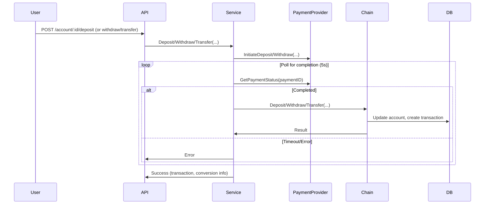
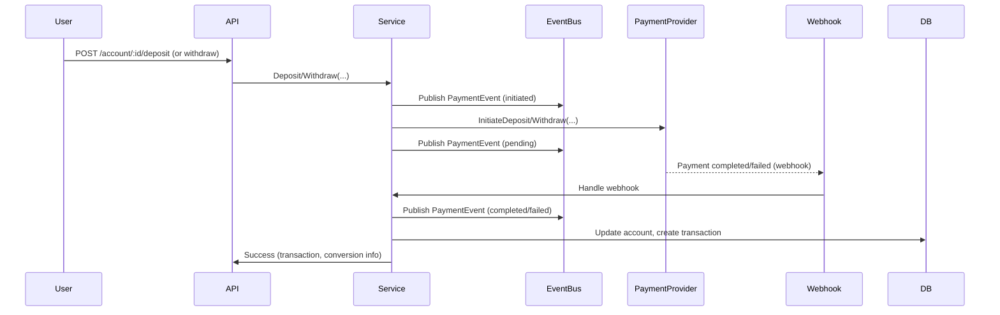
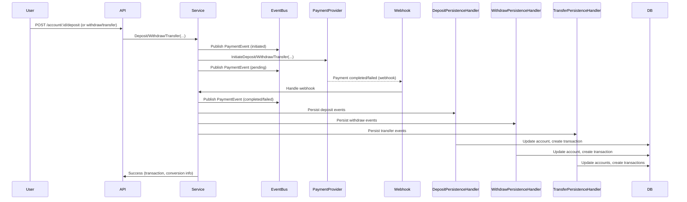
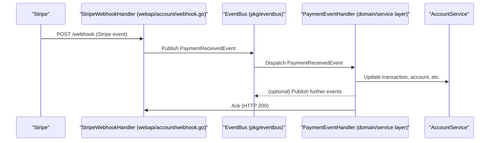

# Event-Driven Payments

## 🏁 Flow Description

1. **API Request**
   - User sends a request to deposit, withdraw, or transfer funds via the API (`/account/:id/deposit`, `/account/:id/withdraw`, `/account/:id/transfer`).
   - The Fiber handler parses and validates the request, then calls the corresponding method on the `account.Service`.

2. **Service Layer**
   - The service method (`Deposit`, `Withdraw`, `Transfer`) initiates the payment with the (mock) payment provider.
   - For deposits/withdrawals, the service **polls** the payment provider for up to 5 seconds, checking if the payment is completed.
       - If the payment is not completed in time, it returns an error.
       - If completed, it proceeds to the next step.

3. **Business Logic (Chain of Responsibility)**
   - The service calls the `accountChain` (chain of responsibility pattern) to perform the business operation:
       - **Validation**: Checks account/user validity.
       - **Money Creation**: Constructs the money value object.
       - **Currency Conversion**: Converts currency if needed.
       - **Domain Operation**: Executes the deposit/withdraw/transfer on the domain model.
       - **Persistence**: Updates the account and creates the transaction in the database.

4. **API Response**
   - The handler serializes the transaction and conversion info (if any) and returns a success response to the client.

## 🖼️ Mermaid Diagram: Current Payment Flow



## 🔄 Event-Driven Payment Flow Migration

## 🏗️ High-Level Architecture

1. **User initiates deposit/withdrawal.**
   - System creates a transaction with status `initiated`.
   - **A `PaymentEvent` with status `initiated` is published.**
2. **Payment is sent to provider and is in progress.**
   - System publishes a `PaymentEvent` with status `pending`.
   - Returns immediately to the user (no blocking or polling).
3. **Payment provider processes the payment.**
   - When done, it sends a webhook/callback to your service.
4. **Webhook handler receives confirmation.**
   - Updates the transaction status to `completed` or `failed`.
   - **A `PaymentEvent` with status `completed` or `failed` is published.**
   - Triggers business logic (e.g., credit/debit account, notify user).
5. **User/client can poll or subscribe for status updates.**

## 🔔 Event Publishing in the Service Layer

The service publishes a `PaymentEvent` at each stage:

- **Initiated:** When payment is requested by the user
- **Pending:** After provider call, while waiting for confirmation
- **Completed:** When payment is confirmed and business logic succeeds
- **Failed:** On payment provider error, timeout, or business error

**Example:**

```go
_ = s.eventBus.PublishPaymentEvent(account.PaymentEvent{
    EventID:       uuid.NewString(),
    TransactionID: resp.Transaction.ID.String(),
    AccountID:     accountID.String(),
    UserID:        userID.String(),
    Amount:        int64(amount * 100),
    Currency:      string(currencyCode),
    Status:        account.PaymentStatusCompleted, // or Initiated/Pending/Failed
    Provider:      "mock",
    Timestamp:     time.Now().Unix(),
    Metadata:      map[string]string{"operation": "deposit"},
})
```

## 🧪 In-Memory Event Bus for Testing

For local development and testing, the `MemoryEventBus` implementation records all published events in a slice. This allows tests to assert on the number, order, and content of events:

```go
memBus := &eventbus.MemoryEventBus{}
svc := accountsvc.NewService(accountsvc.ServiceDeps{
    // ...
    EventBus: memBus,
})
// ...
tx, _, err := svc.Deposit(userID, accountID, 100.0, currency.USD, "Cash")
require.NoError(t, err)
require.Len(t, memBus.Events, 4) // initiated, pending, completed, etc.
assert.Equal(t, accountdomain.PaymentStatusInitiated, memBus.Events[0].Status)
assert.Equal(t, accountdomain.PaymentStatusPending, memBus.Events[1].Status)
assert.Equal(t, accountdomain.PaymentStatusCompleted, memBus.Events[3].Status)
```

## 🖼️ Mermaid Diagram: Event-Driven Payment Flow



## 🔁 Transaction Lifecycle

- **pending:** Payment initiated, awaiting confirmation.
- **completed:** Payment confirmed by provider, funds credited/debited.
- **failed:** Payment failed or was rejected by provider.

## 🔗 Endpoints

- **POST /account/:id/deposit**
  - Initiates a deposit, creates a `pending` transaction.
  - Returns transaction ID and status.

- **POST /account/:id/withdraw**
  - Initiates a withdrawal, creates a `pending` transaction.
  - Returns transaction ID and status.

- **POST /webhook/payment**
  - Receives payment provider webhook/callback.
  - Validates and updates transaction status.
  - Triggers business logic (credit/debit, notification).

- **GET /transaction/:id/status** (optional)
  - Returns current status of a transaction for polling clients.

## 🚧 Migration Plan

1. **Add `status` field to transaction model and database.**
2. **Refactor service methods to create `pending` transactions and return immediately.**
3. **Implement webhook/callback endpoint for payment confirmation.**
4. **Update business logic to process status changes asynchronously.**
5. **Update tests and mocks to simulate webhook/callbacks.**
6. **Document new flow for team and clients.**

## 🔬 Testing and Observability

- **Unit tests:** Cover all transaction state transitions and error cases.
- **Integration/E2E tests:** Simulate full payment flow, including webhook delivery.
- **Logging:** Log all state changes, webhook receipts, and errors.
- **Tracing:** Use OpenTelemetry to trace payment initiation, webhook handling, and status updates.
- **Metrics:** Track transaction counts, status transitions, webhook latency, and error rates.

## 🏅 Best Practices

- **Webhook Security:** Validate signatures, use HTTPS, and ensure idempotency.
- **Error Handling:** Implement retries and dead-letter queues for failed webhooks.
- **Extensibility:** Design for multiple payment providers and future event types.
- **User Notification:** Optionally notify users on status changes (email, websocket, etc.).
- **Documentation:** Keep this doc and API references up to date as the system evolves.

## 🏦 Business Logic and Persistence (After Mega Refactor)

- Persistence is now handled by operation-specific handlers:
  - `DepositPersistenceHandler`
  - `WithdrawPersistenceHandler`
  - `TransferPersistenceHandler`
- Each handler pulls domain events and uses `transaction_factory.go` helpers to create transactions.
- Webhook triggers the correct handler and updates both transaction status and account balance.
- The legacy monolithic handler is removed.

## 📈 Updated Mermaid Diagram: Event-Driven Payment Flow



## 🖼️ Mermaid Diagram: Stripe Webhook Event-Driven Flow



---

_This document is a living guide. Update as the migration progresses and new requirements emerge._
