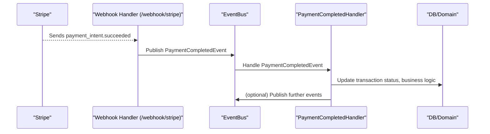

# ⚡ Event-Driven Stripe Webhook Flow

> **Modular, event-driven payment confirmation for Stripe**

## 🏁 Overview

This document describes the event-driven architecture for handling Stripe payment webhooks in the fintech project. The HTTP handler emits a domain event to the event bus, and all business logic is handled by event-driven subscribers. This approach improves modularity, testability, and extensibility.

## 🏗️ Architecture & Sequence

The Stripe webhook flow is fully event-driven:

- The HTTP handler receives the Stripe event and publishes a `PaymentCompletedEvent` to the event bus.
- Event handlers (subscribers) listen for this event and perform business logic (e.g., updating transaction status, crediting accounts).
- The event bus orchestrates the flow, decoupling HTTP and business logic.

### 🖼️ Sequence Diagram

## 🔄 Detailed Flow

1. **Stripe sends a webhook** to `/webhook/stripe` (e.g., `payment_intent.succeeded`).
2. **Webhook handler** parses the event and publishes a `PaymentCompletedEvent` to the event bus.
3. **EventBus** dispatches the event to all registered subscribers.
4. **PaymentCompletedHandler** (subscriber) updates the transaction status in the database and triggers any required business logic.
5. **Further events** can be published for downstream processing (e.g., notifications).

## 🧩 Key Components

- **HTTP Handler:** [`webapi/account/webhook.go`](https://github.com/amirasaad/fintech/webapi/account/webhook.go)
- **EventBus:** [`pkg/eventbus`](https://github.com/amirasaad/fintech/pkg/eventbus/)
- **Payment Event Handlers:** [`pkg/handler/payment/`](https://github.com/amirasaad/fintech/pkg/handler/payment/)
- **Domain Events:** [`pkg/domain/account/events/`](https://github.com/amirasaad/fintech/pkg/domain/account/events/)

## 🧪 Testing

- **Unit tests:** Use a mock event bus to verify the handler publishes the correct event ([webapi/account/webhook_test.go](https://github.com/amirasaad/fintech/webapi/account/webhook_test.go)).
- **Integration tests:** Register real event handlers and assert on database state and event flow.
- **Fixtures/mocks:** Use [internal/fixtures/mocks/](https://github.com/amirasaad/fintech/internal/fixtures/mocks/) for repository and UoW mocks.

## 🛠️ Extending the Flow

- Add new event handlers by subscribing to the event bus in your app setup.
- To support new Stripe event types, update the webhook handler to emit the appropriate domain event.
- All business logic should be implemented in event handlers, not in the HTTP handler.

## 📚 References

- [Event-Driven Payments](event-driven-payments.md)
- [Stripe Integration](stripe-integration.md)
- [EventBus Implementation](https://github.com/amirasaad/fintech/pkg/eventbus/)
- [Payment Handlers](https://github.com/amirasaad/fintech/pkg/handler/payment/)
- [Webhook Handler Tests](https://github.com/amirasaad/fintech/webapi/account/webhook_test.go)
