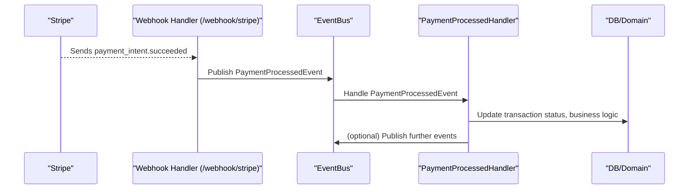

# ⚡ Event-Driven Stripe Webhook Flow

> **Modular, event-driven payment confirmation for Stripe**

## 🏁 Overview

This document describes the event-driven architecture for handling Stripe payment webhooks in the fintech project. The HTTP handler emits a domain event to the event bus, and all business logic is handled by event-driven subscribers. This approach improves modularity, testability, and extensibility.

## 🏗️ Architecture & Sequence

The Stripe webhook flow is fully event-driven:

- The HTTP handler receives the Stripe event and publishes a `PaymentProcessedEvent` to the event bus.
- Event handlers (subscribers) listen for this event and perform business logic (e.g., updating transaction status, crediting accounts).
- The event bus orchestrates the flow, decoupling HTTP and business logic.

### 📝 Webhook Payload Examples

#### 1. Generic Payment Webhook

##### **Request**

```http
POST /webhook/payment
Content-Type: application/json

{
  "payment_id": "pi_3NxabcXYZpqr123",
  "status": "completed"
}
```

##### **Success Response**

```http
HTTP/1.1 200 OK
Content-Length: 0
```

##### **Error Response**

```http
HTTP/1.1 400 Bad Request
Content-Type: application/json

{
  "error": "Invalid payload"
}
```

#### 2. Stripe Webhook

##### **Request**

```http
POST /webhook/stripe
Content-Type: application/json
Stripe-Signature: t=1234567890,v1=abc123...

{
  "id": "evt_123456789",
  "type": "payment_intent.succeeded",
  "data": {
    "object": {
      "id": "pi_3NxabcXYZpqr123",
      "amount": 1000,
      "currency": "usd",
      "status": "succeeded"
    }
  }
}
```

##### **Success Response**

```http
HTTP/1.1 200 OK
Content-Length: 0
```

##### **Error Response**

```http
HTTP/1.1 400 Bad Request
Content-Type: application/json

{
  "error": "Invalid Stripe event"
}
```

### 🖼️ Sequence Diagram



## 🔄 Detailed Flow

1. **Stripe sends a webhook** to `/webhook/stripe` (e.g., `payment_intent.succeeded`).
2. **Webhook handler** parses the event and publishes a `PaymentProcessedEvent` to the event bus.
3. **EventBus** dispatches the event to all registered subscribers.
4. **PaymentProcessedHandler** (subscriber) updates the transaction status in the database and triggers any required business logic.
5. **Further events** can be published for downstream processing (e.g., notifications).

## 🧩 Key Components

- **HTTP Handler:** [`webapi/account/webhook.go`](https://github.com/amirasaad/fintech/webapi/account/webhook.go)
- **EventBus:** [`pkg/eventbus`](https://github.com/amirasaad/fintech/pkg/eventbus/)
- **Payment Event Handlers:** [pkg/handler/payment/](https://github.com/amirasaad/fintech/pkg/handler/payment/)
- **Domain Events:** [pkg/domain/events/](https://github.com/amirasaad/fintech/pkg/domain/events/)

## 🔒 Error Handling

Webhook handlers implement the following error handling:

### 1. Validation Errors (400 Bad Request)

- Missing or invalid required fields
- Malformed JSON payload
- Invalid status values
- Stripe signature verification failure

### 2. Business Logic Errors (500 Internal Server Error)

- Database operation failures
- Event bus publishing failures
- Unexpected errors during processing

### 3. Rate Limiting (429 Too Many Requests)

- Implemented at the reverse proxy/API gateway level
- Protects against abuse and DoS attacks

### 4. Idempotency

- All webhook handlers are idempotent
- Duplicate events with the same ID are processed only once
- Implemented using transaction IDs and event deduplication

## 🧪 Testing

- **Unit tests:** Use a mock event bus to verify the handler publishes the correct event ([webapi/account/webhook_test.go](https://github.com/amirasaad/fintech/webapi/account/webhook_test.go)).
- **Integration tests:** Register real event handlers and assert on database state and event flow.
- **Fixtures/mocks:** Use [internal/fixtures/mocks/](https://github.com/amirasaad/fintech/internal/fixtures/mocks/) for repository and UoW mocks.

## 🛠️ Extending the Flow

### Adding New Webhook Handlers

1. Create a new handler function in the appropriate package
2. Register the handler with the router in `webapi/account/webhook.go`
3. Implement business logic in event handlers

### Supporting New Stripe Event Types

1. Add a new case in the `StripeWebhookHandler`
2. Create a corresponding domain event if needed
3. Update the event bus subscriptions

### Example: Adding PayPal Webhook

```go
// 1. Add new handler function
func PayPalWebhookHandler(svc *service.AccountService) fiber.Handler {
    return func(c *fiber.Ctx) error {
        // Parse and validate PayPal webhook
        // Emit appropriate domain events
    }
}

// 2. Register in router
router.Post("/webhook/paypal", PayPalWebhookHandler(accountSvc))
```

### Best Practices

- Keep HTTP handlers thin
- Validate all inputs
- Log all important operations
- Implement proper error handling
- Use context for cancellation and timeouts

## 📚 References

- [Event-Driven Payments](event-driven-payments.md)
- [Stripe Integration](stripe-integration.md)
- [EventBus Implementation](https://github.com/amirasaad/fintech/pkg/eventbus/)
- [Payment Handlers](https://github.com/amirasaad/fintech/pkg/handler/payment/)
- [Webhook Handler Tests](https://github.com/amirasaad/fintech/webapi/account/webhook_test.go)
