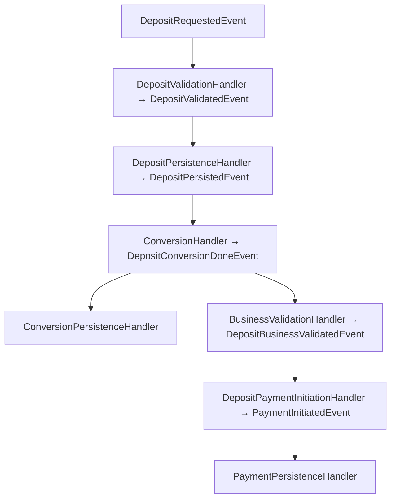
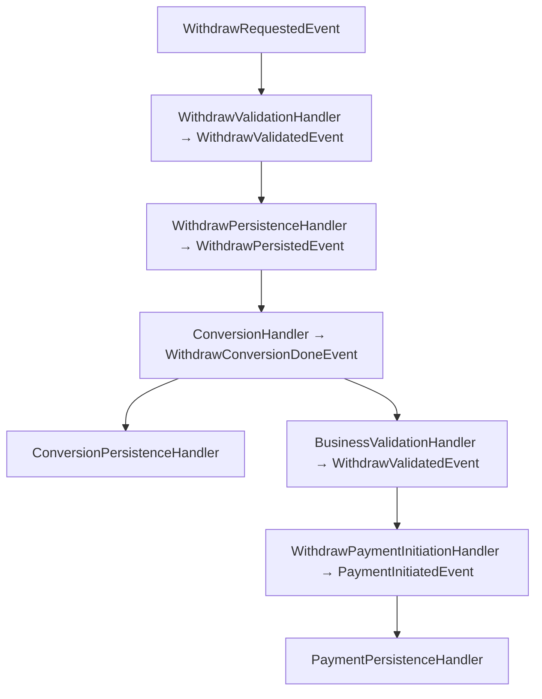
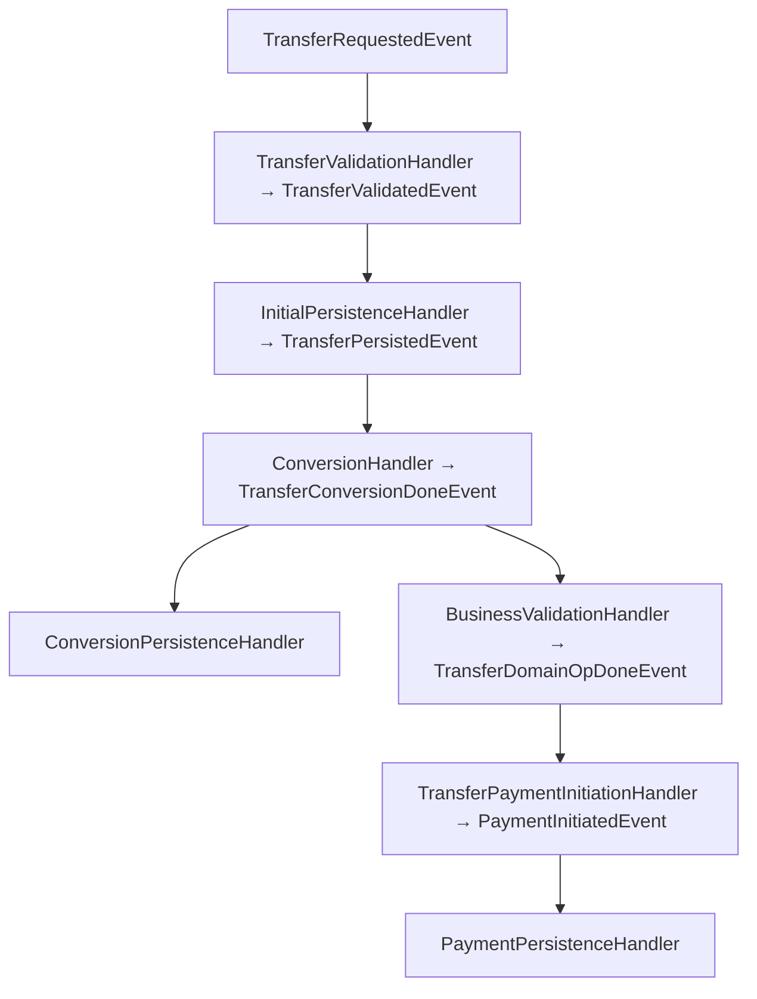

# Deposit/Payment Event Flow Refactor

## Overview
This document explains the refactored, cycle-free, DRY event-driven flow for deposit and payment initiation. It covers handler responsibilities, idempotency, and anti-cycle design, with a Mermaid diagram and troubleshooting tips.

---

## Updated Deposit Event Flow Diagram



---

## Handler Responsibilities (Deposit Flow)

- **DepositValidationHandler**: Validates deposit request, emits `DepositValidatedEvent`.
- **DepositPersistenceHandler**: Persists validated deposit, emits `DepositPersistedEvent`.
- **ConversionHandler**: Handles currency conversion, emits `DepositConversionDoneEvent`.
- **ConversionPersistenceHandler**: Persists conversion data, idempotent, logs all actions.
- **BusinessValidationHandler**: Performs business checks, emits `DepositBusinessValidatedEvent`, idempotent.
- **DepositPaymentInitiationHandler**: Initiates payment, emits `PaymentInitiatedEvent`, idempotent.
- **PaymentPersistenceHandler**: Persists payment info, idempotent if needed.

---

## Idempotency & Anti-Cycle Design

- Each handler uses a `sync.Map` (or persistent store) to track processed TransactionIDs.
- If a duplicate event is received, the handler logs and skips emission (`[SKIP]`).
- No handler emits an event that can re-trigger itself or a previous handler.
- This design prevents infinite loops and duplicate payment initiations.

---

## Example Logs (Deposit Flow)

```
[START] Received event handler=DepositValidationHandler event_type=DepositRequestedEvent ...
✅ [SUCCESS] Account validated, emitting DepositValidatedEvent ...
[START] Received event handler=DepositPersistenceHandler event_type=DepositValidatedEvent ...
✅ [SUCCESS] Transaction persisted ...
[START] Received event handler=ConversionHandler event_type=DepositPersistedEvent ...
✅ [SUCCESS] Conversion done, emitting DepositConversionDoneEvent ...
[START] Received event handler=ConversionPersistenceHandler event_type=DepositConversionDoneEvent ...
✅ [SUCCESS] Conversion data persisted ...
[START] Received event handler=BusinessValidationHandler event_type=DepositConversionDoneEvent ...
✅ [SUCCESS] Business validation passed, emitting DepositBusinessValidatedEvent ...
[START] Received event handler=DepositPaymentInitiationHandler event_type=DepositBusinessValidatedEvent ...
✅ [SUCCESS] Initiating payment, emitting PaymentInitiatedEvent ...
[START] Received event handler=PaymentPersistenceHandler event_type=PaymentInitiatedEvent ...
✅ [SUCCESS] Payment info persisted ...
```

---

## Updated Withdraw Event Flow Diagram



---

## Updated Transfer Event Flow Diagram



---

## Handler Responsibilities (Withdraw Flow)

- **WithdrawValidationHandler**: Validates withdraw request, emits `WithdrawValidatedEvent`.
- **WithdrawPersistenceHandler**: Persists validated withdraw, emits `WithdrawPersistedEvent`.
- **ConversionHandler**: Handles currency conversion, emits `WithdrawConversionDoneEvent`.
- **ConversionPersistenceHandler**: Persists conversion data, idempotent, logs all actions.
- **BusinessValidationHandler**: Performs business checks, emits `WithdrawValidatedEvent`, idempotent.
- **WithdrawPaymentInitiationHandler**: Initiates payment, emits `PaymentInitiatedEvent`, idempotent.
- **PaymentPersistenceHandler**: Persists payment info, idempotent if needed.

---

## Handler Responsibilities (Transfer Flow)

- **TransferValidationHandler**: Validates transfer request, emits `TransferValidatedEvent`.
- **InitialPersistenceHandler**: Persists initial transfer, emits `TransferPersistedEvent`.
- **ConversionHandler**: Handles currency conversion, emits `TransferConversionDoneEvent`.
- **ConversionPersistenceHandler**: Persists conversion data, idempotent, logs all actions.
- **BusinessValidationHandler**: Performs business checks, emits `TransferDomainOpDoneEvent`, idempotent.
- **TransferPaymentInitiationHandler**: Initiates payment, emits `PaymentInitiatedEvent`, idempotent.
- **PaymentPersistenceHandler**: Persists payment info, idempotent if needed.

---

## Troubleshooting Tips (All Flows)

- **Multiple events for the same transaction?**
  - Check idempotency logic in each handler.
  - Ensure no handler emits an event that can re-trigger itself or a previous handler.
- **Event chain not progressing?**
  - Check logs for `[SKIP]` or `[ERROR]` messages.
  - Ensure each handler emits only the next event in the chain.
- **Missing logs or correlation IDs?**
  - Add structured logging with `correlation_id`, `transaction_id`, and event type in each handler.

---

## Summary

This refactor ensures a clean, DRY, and cycle-free event-driven deposit/payment flow with robust idempotency and clear logging for easy troubleshooting.
