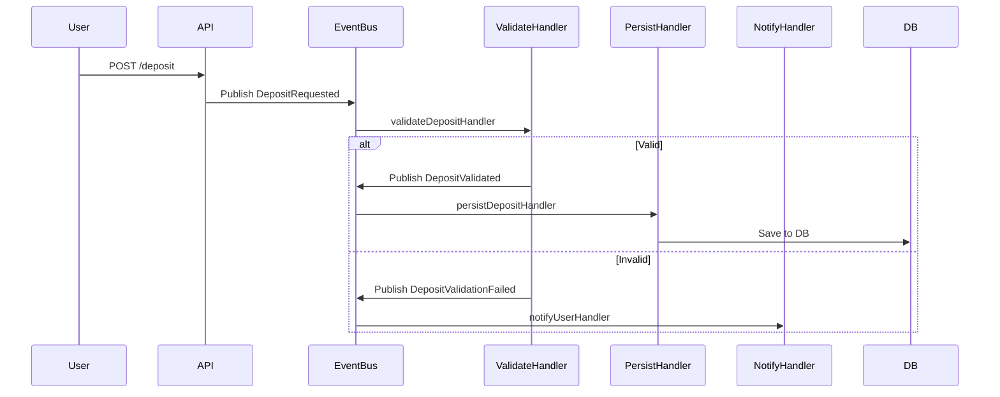

# Event-Driven Architecture: Event Chaining Pattern

## Overview

This document describes the event-driven architecture (EDA) pattern adopted in this project, with a focus on **event chaining** for dependent business logic. It explains why we moved away from both Chain of Responsibility (CoR) and naive multi-handler event buses, and how event chaining enables clear, maintainable, and extensible workflows.

---

## Why Event Chaining?

- **Naive multi-handler event bus**: All handlers for an event run independently. This is great for fan-out (e.g., logging, notifications), but not for workflows where one step must succeed before the next (e.g., validation before persistence).
- **Chain of Responsibility**: Enforces sequential logic, but mixes concerns and is less idiomatic in event-driven systems.
- **Event Chaining**: Each handler emits a new event if its step succeeds. Only the next step’s handler(s) listen for that new event. This keeps each handler focused, testable, and composable.

---

## Pattern: Event Chaining

### 1. **Each Handler Does One Thing**

- Validates, persists, notifies, etc.—but never orchestrates the whole workflow.

### 2. **Handlers Emit New Events**

- If a step succeeds, emit the next event (e.g., `DepositValidated`).
- If a step fails, emit a failure event (e.g., `DepositValidationFailed`).

### 3. **Handlers for Next Step Listen for the New Event**

- Persistence only happens if validation succeeded, etc.

---

## Example: Deposit Workflow

```go
// Handler for DepositRequested
func validateDepositHandler(event Event) error {
    if !isValid(event.Data) {
        bus.Publish(Event{Type: "DepositValidationFailed", Data: event.Data})
        return nil
    }
    bus.Publish(Event{Type: "DepositValidated", Data: event.Data})
    return nil
}

// Handler for DepositValidated
func persistDepositHandler(event Event) error {
    // Only called if validation succeeded
    saveToDB(event.Data)
    return nil
}

// Handler for DepositValidationFailed
func notifyUserHandler(event Event) error {
    // Notify user of validation failure
    return nil
}
```

**Registration:**

```go
bus.Register("DepositRequested", validateDepositHandler)
bus.Register("DepositValidated", persistDepositHandler)
bus.Register("DepositValidationFailed", notifyUserHandler)
```

---

## Sequence Diagram



---

## Summary Table

| Pattern         | Validation Fails | Persistence Proceeds? | Notes                        |
|-----------------|------------------|-----------------------|------------------------------|
| Multi-handler   | Yes              | Yes                   | Not safe for dependent steps |
| CoR (chain)     | No               | No                    | Sequential, but less ED      |
| Event chaining  | No               | No                    | Each step emits next event   |

---

## Best Practices

- **Use event chaining for dependent business logic.**
- **Use multiple handlers per event for true fan-out (independent side effects).**
- **Keep handlers small, focused, and testable.**
- **Document event flows and event types clearly.**
- **Avoid orchestration logic in handlers—let the event flow drive the process.**

---

## Final Thought
>
> "In event-driven systems, clarity comes from explicit event flows, not from hidden chains or switches. Let events tell the story."
