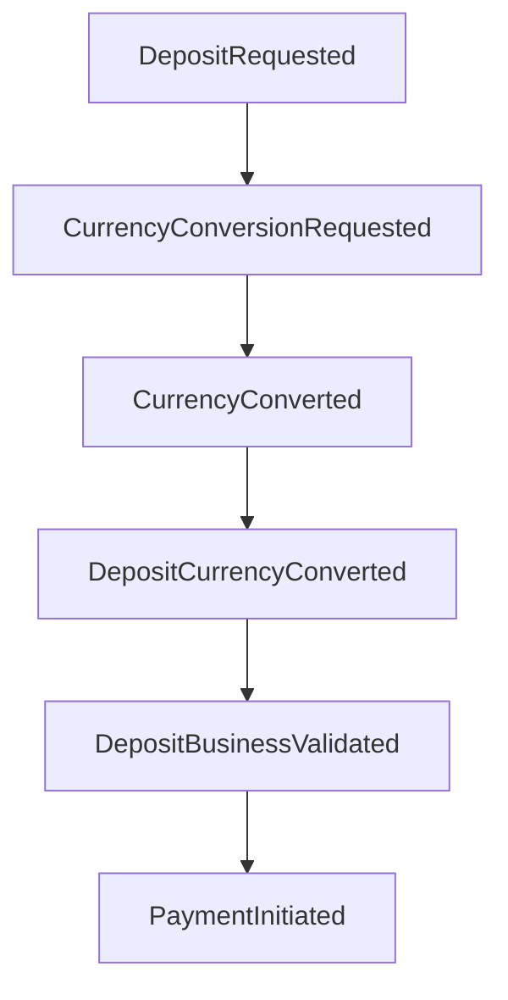
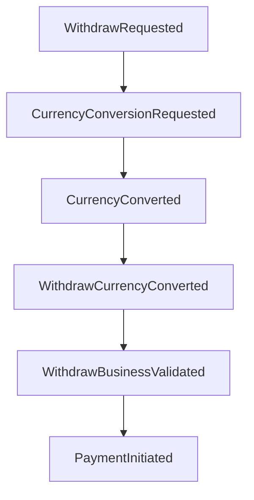
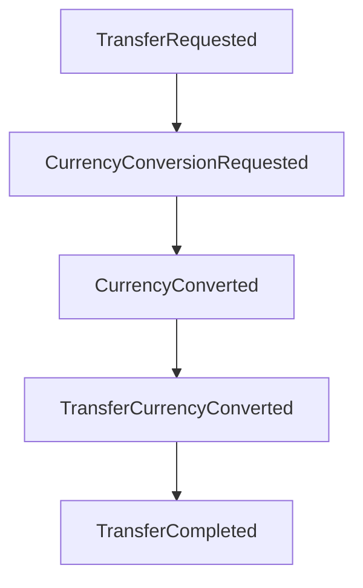

# Event-Driven Architecture 🔄

## Overview

Our fintech application follows an event-driven architecture that decouples business operations, currency conversion, and payment processing. This design enables flexible, testable, and maintainable multi-currency financial operations.

## Core Design Principles

### 1. Separation of Concerns

- **Currency Conversion**: Pure, reusable service with no side effects
- **Business Validation**: Always performed after conversion in account's native currency
- **Payment Processing**: Triggered by business validation, not conversion
- **Domain Operations**: Executed after all validations pass

### 2. Event Chaining Pattern

Events flow through a chain of handlers, each responsible for a specific concern:

```
User Request → Validation → Conversion (if needed) → Business Validation → Payment/Domain Op → HandleProcessed
```

### 3. Multi-Currency Handling

- All business invariants (sufficient funds, limits) are checked in the account's native currency
- Currency conversion is applied before validation, ensuring accurate checks
- Payment processing is decoupled from conversion logic

## Event Flow Architecture

### Deposit Flow



### Withdraw Flow



### Transfer Flow



## Key Design Decisions

### 1. Decoupled Currency Conversion

**Problem**: Original design coupled currency conversion with payment initiation, making it difficult to reuse conversion logic and maintain clean separation of concerns.

**Solution**: Currency conversion is now a pure, reusable service that:

- Has no side effects
- Doesn't trigger payment processing
- Can be used by any business operation
- Emits generic `CurrencyConversionRequested` and `CurrencyConverted`

**Benefits**:

- Reusable across all operations (deposit, withdraw, transfer)
- Easier to test and mock
- No code duplication
- Clear separation of concerns

### 2. Business Validation After Conversion

**Problem**: Business invariants (sufficient funds, limits) were sometimes checked before currency conversion, leading to incorrect validations.

**Solution**: All business validations are performed after currency conversion:

- Sufficient funds check in account's native currency
- Maximum/minimum limits in account's native currency
- All business rules applied to converted amounts

**Benefits**:

- Accurate validation regardless of request currency
- Consistent business rule enforcement
- No currency-related validation bugs

### 3. Payment Triggered by Business Validation

**Problem**: Payment was triggered by conversion completion, not business validation.

**Solution**: Payment initiation is triggered by business validation events:

- `WithdrawBusinessValidated` triggers payment for withdrawals
- `DepositBusinessValidated` triggers payment for deposits
- Business validation ensures all rules pass before payment

**Benefits**:

- Payment only occurs after all validations pass
- Clear audit trail of validation → payment flow
- Easier to add new payment triggers

### 4. Generic vs Business-Specific Events

**Generic Events** (reusable):

- `CurrencyConversionRequested`
- `CurrencyConverted`

**Business-Specific Events** (context-aware):

- `DepositCurrencyConverted`
- `WithdrawCurrencyConverted`
- `TransferCurrencyConverted`

**Benefits**:

- Generic events for reusable logic
- Business-specific events for context-aware operations
- Clear event hierarchy and responsibilities

## Event Definitions

### Generic Conversion Events

```go
type CurrencyConversionRequested struct {
    FlowEvent
    Amount        money.Money
    To            currency.Code
    TransactionID uuid.UUID
}

type CurrencyConverted struct {
    FlowEvent
    TransactionID   uuid.UUID
    ConvertedAmount money.Money
    ConversionInfo  *common.ConversionInfo
}
```

### Business-Specific Events

```go
type DepositCurrencyConverted struct {
    DepositRequested
    CurrencyConverted
    Timestamp time.Time
}

type WithdrawCurrencyConverted struct {
    WithdrawRequested
    CurrencyConverted
    Timestamp time.Time
}

type TransferCurrencyConverted struct {
    TransferRequested
    CurrencyConverted
    Timestamp time.Time
}
```

## Handler Responsibilities

### Generic Conversion Handler

- Handles `ConversionRequestedEvent`
- Performs currency conversion
- Emits `ConversionDoneEvent`
- No business logic or side effects

### Business-Specific Conversion Done Handlers

- Handle `*CurrencyConverted` events
- Perform business validation in account currency
- Emit payment initiation or domain operation events
- Inject payment providers and domain services

### Payment Handlers

- Handle payment initiation events
- Call external payment providers
- Emit payment completion events
- Handle payment failures

### HandleProcessed Handlers

- Handle domain operation completion events
- Persist transactions using Unit of Work
- Emit persistence completion events
- Ensure transactional consistency

## Benefits of This Architecture

### 1. Maintainability

- Clear separation of concerns
- Each handler has a single responsibility
- Easy to modify individual components

### 2. Testability

- Each handler can be tested in isolation
- Mock dependencies easily injected
- Event-driven testing patterns

### 3. Scalability

- Handlers can be scaled independently
- Event bus can be distributed
- Easy to add new business operations

### 4. Flexibility

- New currencies can be added without changing business logic
- New payment providers can be integrated easily
- Business rules can be modified independently

### 5. Observability

- Clear event flow for debugging
- Structured logging at each step
- Audit trail of all operations

## Implementation Guidelines

### 1. Event Handler Structure

```go
func BusinessHandler(deps Dependencies) func(context.Context, domain.Event) {
    return func(ctx context.Context, e domain.Event) {
        logger := deps.Logger.With("handler", "BusinessHandler")

        // 1. Type assertion
        evt, ok := e.(SpecificEvent)
        if !ok {
            logger.Error("unexpected event type", "event", e)
            return
        }

        // 2. Business logic
        logger.Info("processing event", "event", evt)

        // 3. Emit next event
        _ = deps.EventBus.Publish(ctx, NextEvent{})
    }
}
```

### 2. Dependency Injection

- Inject all dependencies (logger, event bus, services)
- Use interfaces for testability
- Follow dependency inversion principle

### 3. Error Handling

- Log errors with context
- Don't panic on unexpected events
- Consider retry strategies for transient failures

### 4. Testing

- Use mocks for external dependencies
- Test event flow end-to-end
- Verify event emissions
- Test error scenarios

## Migration from Previous Architecture

### Changes Made

1. **Decoupled conversion from payment**: Conversion no longer triggers payment
2. **Added business validation after conversion**: All checks in account currency
3. **Introduced generic conversion events**: Reusable across operations
4. **Added business-specific conversion done handlers**: Context-aware operations
5. **Updated event flow**: Clear separation of concerns

### Benefits Achieved

- **Correctness**: All validations in correct currency
- **Flexibility**: Payment triggered by business validation
- **Reusability**: Generic conversion logic
- **Maintainability**: Clear event flow and responsibilities

This architecture provides a solid foundation for multi-currency financial operations while maintaining clean separation of concerns and enabling future extensibility.
