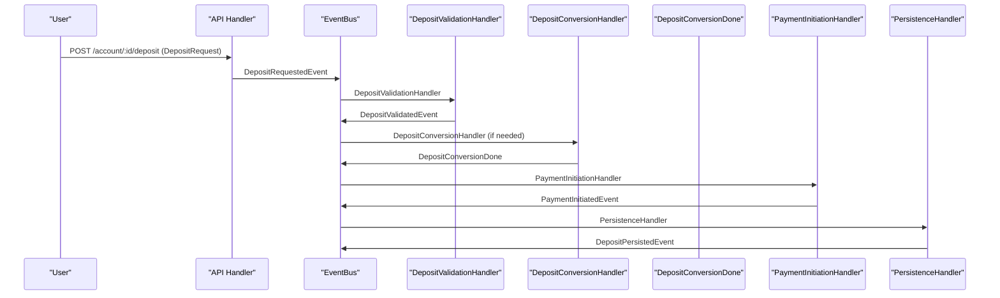
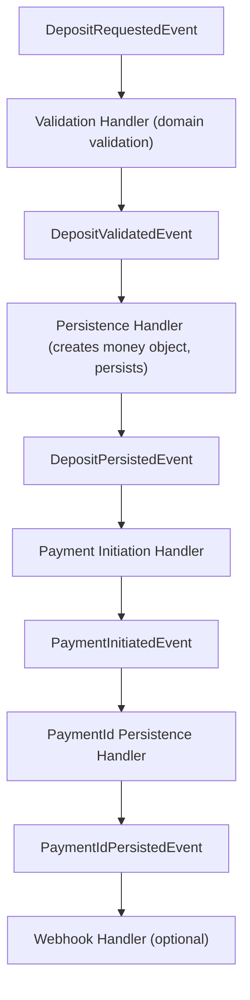

# ⚡ Event-Driven Deposit Flow

This document describes the event-driven architecture for the deposit workflow in the fintech system.

---

## 🏁 Overview

The deposit process is now fully event-driven, with each business step handled by a dedicated event handler. This enables modularity, testability, and clear separation of concerns.

---

## 🖼️ Sequence Diagram



> **Note:** Payment initiation only happens after DepositConversionDone. This avoids coupling conversion with payment for other flows (e.g., transfer).

---

## 🔄 Workflow Clarification: Event-Driven Deposit Flow

The deposit workflow is orchestrated through a series of events and handlers:

1. **User submits deposit request** (amount as `float64`, main unit). API emits `DepositRequestedEvent`.
2. **Validation Handler** loads the account, calls domain validation (`ValidateDeposit`), emits `DepositValidatedEvent`.
3. **Persistence Handler** converts the amount to a `money.Money` value object and persists the transaction, emits `DepositPersistedEvent`.
4. **Payment Initiation Handler** initiates payment, emits `PaymentInitiatedEvent`.
5. **PaymentId Persistence Handler** updates transaction with paymentId, emits `PaymentIdPersistedEvent`.
6. **Webhook Handler** (optional) updates transaction status and account balance on payment confirmation.

### 🖼️ Updated Deposit Workflow Diagram



---

## 🧩 Event-Driven Components

### 1. Validation Handler

- **Purpose:** Performs business validation on the account
- **Events Consumed:** `DepositRequestedEvent`
- **Events Emitted:**
  - `DepositValidatedEvent` - When validation passes
  - (TODO: `DepositValidationFailedEvent` - When validation fails)
- **Validation Rules:**
  - Account exists and belongs to user
  - Account has valid ID
  - Account is in valid state for operations

### 2. Persistence Handler

- **Purpose:** Converts the amount to a `money.Money` value object and persists the deposit transaction to the database
- **Events Consumed:** `DepositValidatedEvent`
- **Events Emitted:** `DepositPersistedEvent`

### 3. Payment Initiation Handler

- **Purpose:** Initiates payment with external providers
- **Events Consumed:** `DepositPersistedEvent`
- **Events Emitted:** `PaymentInitiatedEvent`

---

## 🛠️ Key Benefits

### 1. **Modularity**

Each handler has a single responsibility and can be developed, tested, and deployed independently.

### 2. **Testability**

- Unit tests for each handler
- Integration tests for event flows
- Easy mocking of dependencies

### 3. **Scalability**

- Handlers can be scaled independently
- Event-driven architecture supports async processing
- Easy to add new handlers without modifying existing code

### 4. **Maintainability**

- Clear separation of concerns
- Easy to understand and modify individual components
- Consistent patterns across all handlers

### 5. **Event Sourcing Ready**

- All business events are captured
- Easy to implement event sourcing patterns
- Audit trail of all operations

---

## 🛠️ Implementation Details

### Validation Handler Pattern

```go
// Validation handler listens to deposit request events
func DepositValidationHandler(bus eventbus.EventBus, logger *slog.Logger) func(context.Context, domain.Event) {
    return func(ctx context.Context, e domain.Event) {
        event, ok := e.(accountdomain.DepositRequestedEvent)
        if !ok {
            return
        }

        // Perform business validation
        if validationFails {
            // TODO: Emit DepositValidationFailedEvent
            return
        }

        // Emit validation success
        _ = bus.Publish(ctx, accountdomain.DepositValidatedEvent{...})
    }
}
```

### Persistence Handler Pattern

```go
// Persistence handler listens to validated deposit events
func DepositPersistenceHandler(bus eventbus.EventBus, uow repository.UnitOfWork, logger *slog.Logger) func(context.Context, domain.Event) {
    return func(ctx context.Context, e domain.Event) {
        event, ok := e.(accountdomain.DepositValidatedEvent)
        if !ok {
            return
        }
        // Convert amount to money.Money and persist transaction
        // ...
        _ = bus.Publish(ctx, accountdomain.DepositPersistedEvent{...})
    }
}
```

---

## 🛠️ Error Handling

### Validation Failures
- Account inactive
- Insufficient balance
- Business rule violations
- Invalid account state

### Event Flow on Errors
1. Validation handler emits `DepositValidationFailedEvent` (TODO)
2. Persistence handler is not triggered
3. Error is returned to the caller
4. Audit trail is maintained through events

---

## 🧪 Testing Strategy

### Unit Tests
- Test each handler independently
- Mock event bus and dependencies
- Test success and failure scenarios

### Integration Tests
- Test complete event flows
- Use real event bus
- Verify event sequences

### End-to-End Tests
- Test full API endpoints
- Verify business outcomes
- Test error scenarios

---

## 📚 Related Documentation

- [Event-Driven Architecture Overview](https://github.com/amirasaad/fintech/architecture.md)
