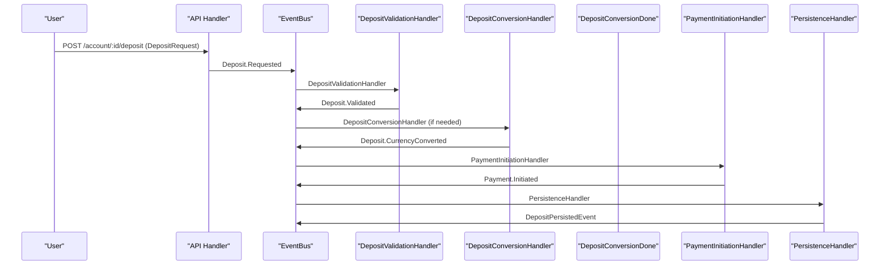
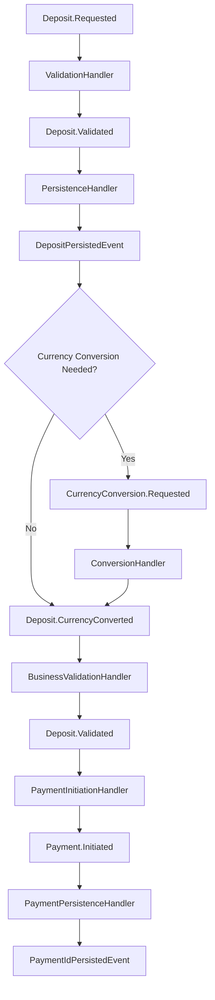

# ⚡ Event-Driven Deposit Flow

This document describes the current event-driven architecture for the deposit workflow in the fintech system.

---

## 🏁 Overview

The deposit process is fully event-driven, with each business step handled by a dedicated event handler. This enables modularity, testability, and clear separation of concerns.

---

## 🖼️ Current Event Flow



---

## 🔄 Current Workflow: Event Chain

The deposit workflow follows this event chain:

1. **`Deposit.Requested`** → ValidationHandler
2. **`Deposit.Validated`** → PersistenceHandler
3. **`DepositPersistedEvent`** → ConversionHandler (if currency conversion needed)
4. **`Deposit.CurrencyConverted`** → BusinessValidationHandler
5. **`Deposit.Validated`** → PaymentInitiationHandler
6. **`Payment.Initiated`** → PaymentPersistenceHandler
7. **`PaymentIdPersistedEvent`** → (End of flow)

### 🖼️ Updated Deposit Workflow Diagram



---

## 🧩 Handler Responsibilities

### 1. Validation Handler (`pkg/handler/account/deposit/validation.go`)

- **Purpose:** Validates deposit request and account ownership
- **Events Consumed:** `Deposit.Requested`
- **Events Emitted:** `Deposit.Validated`
- **Validation Rules:**
  - Account exists and belongs to user
  - Deposit amount is positive
  - Account is in valid state for deposits

### 2. HandleProcessed Handler (`pkg/handler/account/deposit/persistence.go`)

- **Purpose:** Persists deposit transaction to database
- **Events Consumed:** `DepositValidatedEvent`
- **Events Emitted:**
  - `DepositPersistedEvent`
  - `ConversionRequestedEvent` (if currency conversion needed)
- **Operations:**
  - Creates transaction record with "created" status
  - Emits conversion request if deposit currency differs from account currency

### 3. Business Validation Handler (`pkg/handler/account/deposit/business_validation.go`)

- **Purpose:** Performs final business validation after currency conversion
- **Events Consumed:** `Deposit.CurrencyConverted`
- **Events Emitted:** `Payment.Initiated`
- **Validation Rules:**
  - Re-validates account ownership with converted amount
  - Ensures business rules are met in account currency

### 4. Payment Initiation Handler (`pkg/handler/payment/initiation.go`)

- **Purpose:** Initiates payment with external providers
- **Events Consumed:** `Deposit.Validated` or `Withdraw.Validated`
- **Events Emitted:** `Payment.Initiated`
- **Operations:**
  - Integrates with payment providers (e.g., Stripe)
  - Creates payment intent/session

### 5. Payment HandleProcessed Handler (`pkg/handler/payment/persistence.go`)

- **Purpose:** Persists payment ID to transaction record
- **Events Consumed:** `Payment.Initiated`
- **Events Emitted:** `PaymentIdPersistedEvent`
- **Operations:**
  - Updates transaction with payment provider ID
  - Prevents duplicate payment ID persistence

---

## 🛠️ Key Implementation Details

### Event Structure

All deposit events embed the common `FlowEvent`:

```go
type FlowEvent struct {
    FlowType      string    // "deposit"
    UserID        uuid.UUID
    AccountID     uuid.UUID
    CorrelationID uuid.UUID
}
```

### Handler Pattern

Each handler follows a consistent pattern:

```go
func HandlerName(bus eventbus.Bus, uow repository.UnitOfWork, logger *slog.Logger) func(ctx context.Context, e domain.Event) error {
    return func(ctx context.Context, e domain.Event) error {
        log := logger.With("handler", "HandlerName", "event_type", e.Type())

        // Type assertion
        event, ok := e.(events.SpecificEvent)
        if !ok {
            log.Debug("Skipping unexpected event type")
            return nil
        }

        // Business logic
        // ...

        // Emit next event
        return bus.Emit(ctx, nextEvent)
    }
}
```

### Currency Conversion Logic

The persistence handler conditionally emits conversion events:

```go
// Only emit ConversionRequestedEvent if conversion is needed
if ve.Account != nil &&
   ve.Amount.Currency().String() != "" &&
   ve.Account.Currency().String() != "" &&
   ve.Amount.Currency().String() != ve.Account.Currency().String() {

    conversionEvent := events.ConversionRequestedEvent{
        FlowEvent:     ve.FlowEvent,
        Amount:        ve.Amount,
        To:            ve.Account.Currency(),
        TransactionID: txID,
    }
    return bus.Emit(ctx, &conversionEvent)
}
```

---

## 🛠️ Benefits

### 1. **Single Responsibility Principle**

Each handler has one clear responsibility and can be developed/tested independently.

### 2. **Extensibility**

New handlers can be added without modifying existing code.

### 3. **Testability**

- Unit tests for individual handlers
- E2E tests for complete event chains
- Easy mocking of dependencies

### 4. **Traceability**

- Correlation IDs track requests across the entire flow
- Structured logging with emojis for clarity
- Complete audit trail through events

### 5. **Error Handling**

- Handlers can return errors to stop the flow
- Failed transactions are logged but don't create invalid state
- Clear error propagation through the event chain

---

## 🧪 Testing Strategy

### Unit Tests

```go
func TestValidation(t *testing.T) {
    // Test individual handler with mocks
    bus := mocks.NewMockBus(t)
    uow := mocks.NewMockUnitOfWork(t)

    handler := Validation(bus, uow, logger)
    err := handler(ctx, depositRequestedEvent)

    assert.NoError(t, err)
    bus.AssertExpectations(t)
}
```

### E2E Tests

```go
func TestDepositE2EEventFlow(t *testing.T) {
    // Test complete event chain
    emitted := trackEventEmissions()

    bus.Emit(ctx, events.DepositRequested{...})

    assert.Equal(t, []string{
        "Deposit.Requested",
        "Deposit.Validated",
        "DepositPersistedEvent",
        "Deposit.CurrencyConverted",
        "Deposit.Validated",
        "Payment.Initiated",
    }, emitted)
}
```

---

## 🔧 Error Scenarios

### Validation Failures

- Account not found → Handler logs error, returns nil (stops flow)
- Invalid user ID → Handler logs error, returns validation error
- Negative amount → Handler logs error, returns validation error

### HandleProcessed Failures

- Database error → Handler logs error, returns error (stops flow)
- Transaction creation fails → Handler logs error, returns error

### Payment Failures

- Provider error → Handler logs error, may emit PaymentFailedEvent
- Network timeout → Handler logs error, may retry or fail

---

## 📚 Related Documentation

- [Event-Driven Architecture](../architecture.md)
- [Domain Events](../domain-events.md)
- [Event-Driven Withdraw Flow](event-driven-withdraw-flow.md)
- [Event-Driven Transfer Flow](event-driven-transfer-flow.md)
