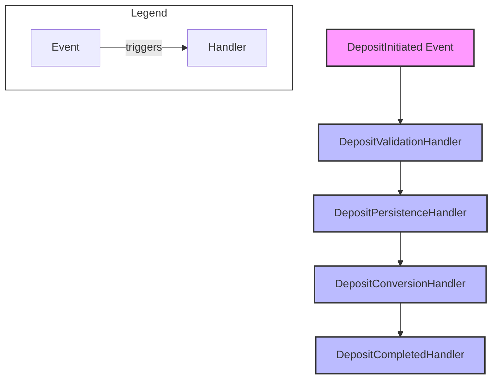

# 🔄 Event-Driven Simplicity Refactor Plan

## 🎯 Goal

Achieve a simple, maintainable, and robust event-driven architecture by:

- Eliminating switch/case control flow in event dispatching
- Preventing infinite event loops
- Enforcing single-responsibility handlers
- Documenting event chains for clarity

---

## 📐 Refactor Steps

### 1. Replace Switch/Case with Event Handler Registry

- **Before:**
  Event dispatch uses switch/case or if/else to route events.
- **After:**
  Use a registry:

  ```go
  map[EventType][]HandlerFunc
  ```

  - Handlers are registered for each event type.
  - On event emission, all registered handlers are invoked.

---

### 2. Guard Against Infinite Event Loops

- Add a propagation context or depth counter to each event.
- Limit event chain depth or track event IDs to prevent re-processing.
- Optionally, use middleware to wrap handlers with loop protection.

---

### 3. Enforce Single Responsibility in Handlers

- Each handler should:
  - Handle one event type
  - Perform one business action
  - Optionally emit one follow-up event
- Split complex handlers into smaller, focused ones.

---

### 4. Document and Visualize Event Chains

- Use Mermaid diagrams or sequence charts to show event flows.
- Document which events trigger which handlers and what follow-up events are emitted.

---

## 🖼️ Event Flow Example



---

### 5. Refactor Event Bus Interface

- Define an interface in `pkg/eventbus`:

  ```go
  type EventBus interface {
      Register(eventType string, handler HandlerFunc)
      Emit(ctx context.Context, event Event) error
  }
  ```

- Implement the registry pattern in `infra/eventbus`.

---

### 6. Testing and Validation

- Write tests for:
  - Event registration and dispatch
  - Loop protection
  - Event chain correctness

---

## :rocket: Example: Event Handler Registry

```go
type HandlerFunc func(ctx context.Context, event Event) error

type EventBus struct {
    handlers map[string][]HandlerFunc
}

func (eb *EventBus) Register(eventType string, handler HandlerFunc) {
    eb.handlers[eventType] = append(eb.handlers[eventType], handler)
}

func (eb *EventBus) Emit(ctx context.Context, event Event) error {
    for _, handler := range eb.handlers[event.Type()] {
        if err := handler(ctx, event); err != nil {
            return err
        }
    }
    return nil
}
```

---

## :bookmark_tabs: Next Steps

1. Refactor event dispatch to use a registry.
2. Add loop protection/context to events.
3. Refactor handlers for single responsibility.
4. Document event flows.
5. Update tests.
