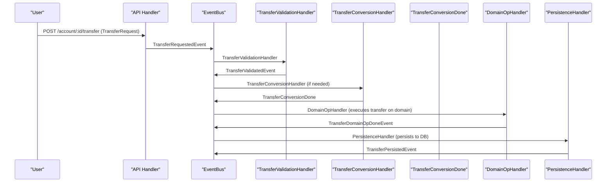
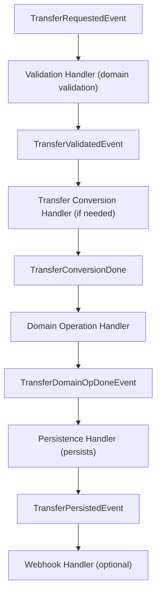

# ⚡ Event-Driven Transfer Flow

## 🚩 Problems & Lessons Learned

### Problem: Coupling Conversion with Payment Initiation

- **Original Issue:** The initial design reused the same CurrencyConversionRequested/CurrencyConversionDone events for all flows (deposit, withdraw, transfer).
- **Consequence:** This led to payment initiation being triggered after every currency conversion, even for internal transfers where no payment should occur.
- **Risk:** Unintended or duplicate payments, confusion, and tightly coupled business logic.

### Problem: If-Statements for Control Flow

- **Original Issue:** To avoid triggering payment for transfers, handlers would check a 'purpose' field or similar, leading to if-else logic in event handlers.
- **Consequence:** This is error-prone, hard to maintain, and against our clean architecture principles.

## 🛠️ Refined Pattern: Distinct Event Types

- **Solution:** Use distinct event types for each business flow (e.g., DepositConversionRequested, TransferConversionRequested, etc.).
- **Result:**
  - Each handler only subscribes to the events it cares about.
  - No if-statements needed for control flow.
  - No accidental cross-flow handling or unintended payments.
  - Clear, decoupled, and extensible event chains.

## 🏁 Overview

The transfer process is fully event-driven, with each business step handled by a dedicated event handler. This enables modularity, testability, and clear separation of concerns, following the same principles as the deposit and withdraw flows.

---

## 🖼️ Sequence Diagram



> **Note:** Payment initiation does NOT happen after TransferConversionDone. This avoids accidental payments for internal transfers.

---

## 🔄 Workflow Clarification: Event-Driven Transfer Flow

The transfer workflow is orchestrated through a series of events and handlers:

1. **User submits transfer request** (amount as `float64`, main unit). API emits `TransferRequestedEvent`.
2. **Validation Handler** loads source and target accounts, checks domain validation (`ValidateTransfer`), emits `TransferValidatedEvent`.
3. **Transfer Conversion Handler** (if needed) converts currency, emits `TransferConversionDone`.
4. **Domain Operation Handler** executes the transfer on the domain model, emits `TransferDomainOpDoneEvent`.
5. **Persistence Handler** persists the transaction(s), emits `TransferPersistedEvent`.
6. **Webhook Handler** (optional) updates transaction status and account balances on payment confirmation.

### 🖼️ Transfer Workflow Diagram



---

## 🧩 Event-Driven Components

### 1. Validation Handler

- **Purpose:** Performs business validation on source and target accounts
- **Events Consumed:** `TransferRequestedEvent`
- **Events Emitted:**
  - `TransferValidatedEvent` - When validation passes
  - (TODO: `TransferValidationFailedEvent` - When validation fails)
- **Validation Rules:**
  - Source and target accounts exist and belong to user
  - Accounts have valid IDs
  - Accounts are in valid state for operations
  - Sufficient balance in source account

### 2. Currency Conversion Handler

- **Purpose:** Converts currency if source and target accounts use different currencies
- **Events Consumed:** `MoneyCreatedEvent`
- **Events Emitted:** `MoneyConvertedEvent`

### 3. Domain Operation Handler

- **Purpose:** Executes the transfer on the domain model
- **Events Consumed:** `MoneyConvertedEvent` (or `MoneyCreatedEvent` if no conversion)
- **Events Emitted:** `TransferDomainOpDoneEvent`

### 4. Persistence Handler

- **Purpose:** Persists the transfer transaction(s) to the database
- **Events Consumed:** `TransferDomainOpDoneEvent`
- **Events Emitted:** `TransferPersistedEvent`

---

## 🛠️ Key Benefits

### 1. **Modularity**

Each handler has a single responsibility and can be developed, tested, and deployed independently.

### 2. **Testability**

- Unit tests for each handler
- Integration tests for event flows
- Easy mocking of dependencies

### 3. **Scalability**

- Handlers can be scaled independently
- Event-driven architecture supports async processing
- Easy to add new handlers without modifying existing code

### 4. **Maintainability**

- Clear separation of concerns
- Easy to understand and modify individual components
- Consistent patterns across all handlers

### 5. **Event Sourcing Ready**

- All business events are captured
- Easy to implement event sourcing patterns
- Audit trail of all operations

---

## 🛠️ Implementation Details

### Validation Handler Pattern

```go
// Validation handler listens to transfer request events
func TransferValidationHandler(bus eventbus.EventBus, logger *slog.Logger) func(context.Context, domain.Event) {
    return func(ctx context.Context, e domain.Event) {
        event, ok := e.(accountdomain.TransferRequestedEvent)
        if !ok {
            return
        }

        // Perform business validation
        if validationFails {
            // TODO: Emit TransferValidationFailedEvent
            return
        }

        // Emit validation success
        _ = bus.Publish(ctx, accountdomain.TransferValidatedEvent{...})
    }
}
```

### Money Creation Handler Pattern

```go
// Money creation handler listens to validated transfer events
func MoneyCreationHandler(bus eventbus.EventBus, logger *slog.Logger) func(context.Context, domain.Event) {
    return func(ctx context.Context, e domain.Event) {
        event, ok := e.(accountdomain.TransferValidatedEvent)
        if !ok {
            return
        }
        // Create money.Money object
        // ...
        _ = bus.Publish(ctx, accountdomain.MoneyCreatedEvent{...})
    }
}
```

---

## 🛠️ Error Handling

### Validation Failures

- Account inactive
- Insufficient balance
- Business rule violations
- Invalid account state

### Event Flow on Errors

1. Validation handler emits `TransferValidationFailedEvent` (TODO)
2. Money creation and subsequent handlers are not triggered
3. Error is returned to the caller
4. Audit trail is maintained through events

---

## 🧪 Testing Strategy

### Unit Tests

- Test each handler independently
- Mock event bus and dependencies
- Test success and failure scenarios

### Integration Tests

- Test complete event flows
- Use real event bus
- Verify event sequences

### End-to-End Tests

- Test full API endpoints
- Verify business outcomes
