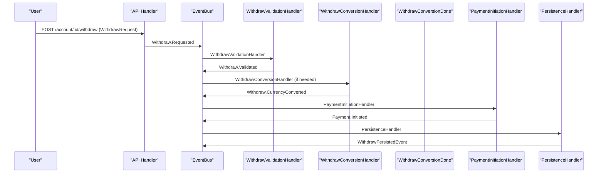
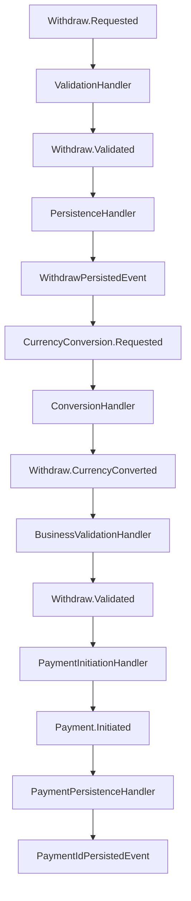

# ⚡ Event-Driven Withdraw Flow

This document describes the current event-driven architecture for the withdraw workflow in the fintech system.

---

## 🏁 Overview

The withdraw process is fully event-driven, with each business step handled by a dedicated event handler. This enables modularity, testability, and clear separation of concerns, following the same principles as the deposit flow.

---

## 🖼️ Current Event Flow



---

## 🔄 Current Workflow: Event Chain

The withdraw workflow follows this event chain:

1. **`Withdraw.Requested`** → ValidationHandler
2. **`Withdraw.Validated`** → PersistenceHandler
3. **`WithdrawPersistedEvent`** → ConversionHandler
4. **`Withdraw.CurrencyConverted`** → BusinessValidationHandler
5. **`Withdraw.Validated`** → PaymentInitiationHandler
6. **`Payment.Initiated`** → PaymentPersistenceHandler
7. **`PaymentIdPersistedEvent`** → (End of flow)

### 🖼️ Event Flow Diagram



---

## 🧩 Handler Responsibilities

### 1. Validation Handler (`pkg/handler/account/withdraw/validation.go`)

- **Purpose:** Validates withdraw request and account ownership
- **Events Consumed:** `Withdraw.Requested`
- **Events Emitted:**
  - `Withdraw.Validated` (success)
  - `Withdraw.Failed` (failure)
- **Validation Rules:**
  - Account exists and belongs to user
  - Withdraw amount is positive
  - Account has sufficient balance
  - Account is in valid state for withdrawals

### 2. HandleProcessed Handler (`pkg/handler/account/withdraw/persistence.go`)

- **Purpose:** Persists withdraw transaction to database
- **Events Consumed:** `Withdraw.Validated`
- **Events Emitted:**
  - `WithdrawPersistedEvent`
  - `CurrencyConversion.Requested` (always emitted for withdraw)
- **Operations:**
  - Creates transaction record with "created" status
  - Always emits conversion request for withdraw flow

### 3. Business Validation Handler (`pkg/handler/account/withdraw/business_validation.go`)

- **Purpose:** Performs final business validation after currency conversion
- **Events Consumed:** `Withdraw.CurrencyConverted`
- **Events Emitted:** `Withdraw.Validated`
- **Validation Rules:**
  - Re-validates account ownership
  - Checks sufficient balance with converted amount
  - Ensures business rules are met in account currency

### 4. Payment Initiation Handler (`pkg/handler/payment/initiation.go`)

- **Purpose:** Initiates payment with external providers
- **Events Consumed:** `Withdraw.Validated` (from withdraw business validated)
- **Events Emitted:** `Payment.Initiated`
- **Operations:**
  - Integrates with payment providers (e.g., Stripe)
  - Creates payment intent for withdrawal

### 5. Payment HandleProcessed Handler (`pkg/handler/payment/persistence.go`)

- **Purpose:** Persists payment ID to transaction record
- **Events Consumed:** `Payment.Initiated`
- **Events Emitted:** `PaymentIdPersistedEvent`
- **Operations:**
  - Updates transaction with payment provider ID
  - Prevents duplicate payment ID persistence

---

## 🛠️ Key Implementation Details

### Event Structure

All withdraw events embed the common `FlowEvent`:

```go
type FlowEvent struct {
    FlowType      string    // "withdraw"
    UserID        uuid.UUID
    AccountID     uuid.UUID
    CorrelationID uuid.UUID
}
```

### Withdraw-Specific Events

```go
type WithdrawRequested struct {
    FlowEvent
    ID                    uuid.UUID
    Amount                money.Money
    BankAccountNumber     string
    RoutingNumber         string
    ExternalWalletAddress string
    Timestamp             time.Time
    PaymentID             string
}

type WithdrawValidated struct {
    WithdrawRequested
    TargetCurrency string
    Account        *account.Account
}

type WithdrawPersistedEvent struct {
    WithdrawValidated
    TransactionID uuid.UUID
}
```

### Validation Logic

The validation handler performs comprehensive checks:

```go
func (a *Account) ValidateWithdraw(userID uuid.UUID, amount money.Money) error {
    if a.UserID != userID {
        return ErrNotOwner
    }
    if err := a.validateAmount(amount); err != nil {
        return err
    }
    // Check sufficient funds
    hasEnough, err := a.Balance.GreaterThan(amount)
    if err != nil {
        return err
    }
    if !hasEnough && !a.Balance.Equals(amount) {
        return ErrInsufficientFunds
    }
    return nil
}
```

### HandleProcessed with Conversion

The persistence handler always emits conversion events for withdrawals:

```go
// Always emit ConversionRequested for withdraw flow
conversionEvent := events.ConversionRequestedEvent{
    FlowEvent:     ve.FlowEvent,
    Amount:        ve.Amount,
    To:            ve.Account.Currency(),
    TransactionID: txID,
}
return bus.Emit(ctx, &conversionEvent)
```

---

## 🛠️ Benefits

### 1. **Consistent Pattern with Deposit**

Follows the same event-driven pattern as deposit flow for consistency.

### 2. **Balance Validation**

Ensures sufficient funds before processing withdrawal.

### 3. **Currency Conversion**

Handles multi-currency withdrawals through conversion events.

### 4. **Payment Integration**

Seamlessly integrates with external payment providers.

### 5. **Audit Trail**

Complete event history for compliance and debugging.

---

## 🧪 Testing Strategy

### Unit Tests

```go
func TestWithdrawValidation(t *testing.T) {
    // Test validation with insufficient funds
    bus := mocks.NewMockBus(t)

    handler := Validation(bus, uow, logger)
    err := handler(ctx, withdrawRequestedEvent)

    // Should emit WithdrawFailedEvent for insufficient funds
    bus.AssertCalled(t, "Emit", mock.MatchedBy(func(e interface{}) bool {
        _, ok := e.(events.WithdrawFailedEvent)
        return ok
    }))
}
```

### E2E Tests

```go
func TestWithdrawE2EEventFlow(t *testing.T) {
    emitted := trackEventEmissions()

    bus.Emit(ctx, events.WithdrawRequested{...})

    assert.Equal(t, []string{
        "Withdraw.Requested",
        "Withdraw.Validated",
        "WithdrawPersistedEvent",
        "Withdraw.CurrencyConverted",
        "Withdraw.Validated",
        "Payment.Initiated",
    }, emitted)
}
```

---

## 🔧 Error Scenarios

### Validation Failures

- **Insufficient Balance:** Handler emits `Withdraw.Failed`
- **Account Not Found:** Handler logs error, returns nil
- **Wrong User:** Handler logs error, returns validation error
- **Invalid Amount:** Handler logs error, returns validation error

### HandleProcessed Failures

- **Database Error:** Handler logs error, returns error (stops flow)
- **Transaction Creation Fails:** Handler logs error, returns error

### Business Validation Failures

- **Post-Conversion Balance Check:** Handler returns error
- **Account State Changed:** Handler returns error

### Payment Failures

- **Provider Error:** Handler logs error, may emit PaymentFailedEvent
- **Network Issues:** Handler logs error, may retry or fail

---

## 🔄 Differences from Deposit Flow

### 1. **Balance Validation**

Withdraw requires checking sufficient funds, deposit does not.

### 2. **Always Convert**

Withdraw always emits conversion events, deposit only when needed.

### 3. **Payment Direction**

Withdraw sends money out, deposit brings money in.

### 4. **Failure Handling**

Withdraw has more failure scenarios due to balance constraints.

---

## 📚 Related Documentation

- [Event-Driven Architecture](../architecture.md)
- [Domain Events](../domain-events.md)
- [Event-Driven Deposit Flow](event-driven-deposit-flow.md)
- [Event-Driven Transfer Flow](event-driven-transfer-flow.md)
