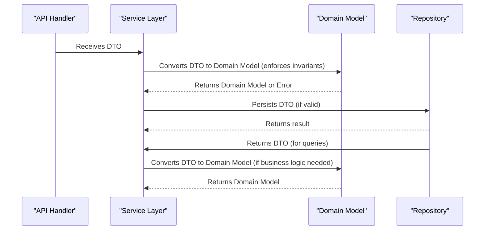

# :material-source-branch: Transaction CQRS Refactor

## 💡 Philosophy

!!! tip
    Patterns are solutions, not goals. Let real problems lead you to the right design pattern, not the other way around.

Adopting design patterns like CQRS should be a response to real, observed pain points in the system. This ensures architecture remains pragmatic, maintainable, and truly solves business needs, rather than introducing unnecessary complexity.

## 🚀 Motivation

!!! info "Why CQRS?"
    As our transaction persistence and event-driven flows have grown, we've encountered increasing complexity in balancing domain purity, auditability, and query flexibility. Our current approach mixes domain models for both writes and reads, leading to:

    - **Leaky** abstractions between domain and infrastructure
    - **Difficulty** evolving read models for reporting/audit
    - **Inflexible** API responses and DTOs

## ⚠️ Pain Points

!!! danger "Pain Points"
    - **Domain Model Pollution:**
    - Read-specific fields and denormalized data are creeping into domain structs.
    - **Query Inflexibility:**
    - Hard to add computed/audit fields to API responses without polluting the domain.
    - **Audit & Reporting:**
    - No clear place for audit trails, event history, or reporting fields.
    - **Separation of Concerns:**
    - Handlers and services are forced to map between domain and API models manually.

## 🔄 CQRS Overview

CQRS (Command Query Responsibility Segregation) separates write (command) and read (query) models:

- **Write Models:** Domain entities and command DTOs for create/update flows.
- **Read Models:** Read-optimized DTOs for queries, reporting, and API responses.

## 📝 Proposed Changes

- **Introduce `TransactionRead` DTO:**
  - A read-optimized struct for queries, API responses, and reporting.
- **Repository Interface Refactor:**
  - Query methods (`Get`, `ListByUser`, `ListByAccount`, etc.) return `TransactionRead` instead of domain `Transaction`.
  - Write methods (`Create`, `Update`, `PartialUpdate`, `Upsert`) continue to use domain models or command DTOs.
- **Handler/Service Refactor:**
  - Handlers/services use the appropriate model for each operation, reducing mapping boilerplate.
- **Documentation & Migration:**
  - Document new flow and migration plan for existing code.

## ⭐ Benefits

- **Separation of Concerns:**
  - Domain model stays pure; read model evolves independently.
- **Auditability:**
  - Read DTOs can include audit/event history fields.
- **API Flexibility:**
  - Easier to shape API responses for frontend/reporting needs.
- **Maintainability:**
  - Reduces coupling and manual mapping in handlers/services.

## 🛡️ Enforcing Domain Invariants with DTOs

A key best practice in CQRS and clean architecture is to keep all business rules and invariants in the domain layer, not in DTOs or repositories. Here’s how to achieve this:

- **DTOs are for data transfer only:** They move data between layers (API, service, repository) and should not contain business logic or enforce invariants.
- **Domain invariants live in the domain model:** All validation and business rules (e.g., valid states, amount > 0, currency checks) must be enforced in domain constructors, methods, or factories.
- **Conversion step:** When receiving a DTO (from API or repository), always convert it to a domain model before applying business logic. If the DTO is invalid, the conversion fails with a domain error.
- **HandleProcessed:** Repositories accept DTOs for storage, but domain logic is always applied before persistence. For reads, repositories return DTOs, and services/handlers convert to domain models if business logic is needed.

**Example Flow:**

1. Handler receives DTO from API.
2. Service converts DTO to domain model (enforcing invariants).
3. If valid, service calls repository to persist DTO.
4. For queries, repository returns DTO; service converts to domain model if needed.

This ensures domain purity, prevents leaking infrastructure concerns into the domain, and keeps business rules centralized and testable.

### Sequence Diagram: Enforcing Domain Invariants with DTOs

## ✅ Next Steps

!!! note "Next Steps"
    - Define `TransactionRead` DTO and update repository interfaces.
    - Refactor query methods to return read DTOs.
    - Update handlers/services to use new models.
    - Document migration and update tests.

---
