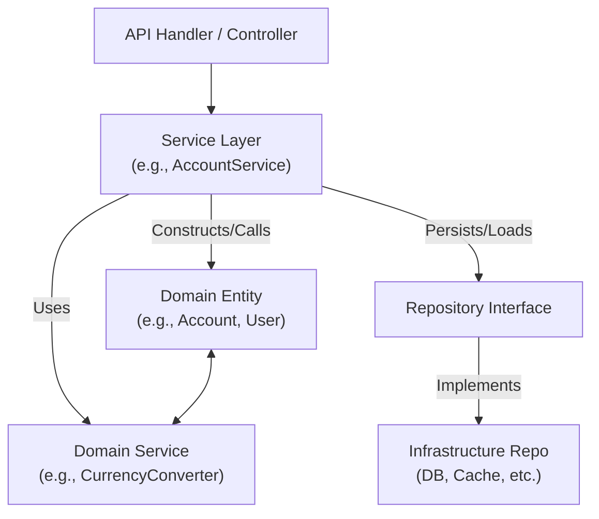

# Service Domain Layer Communication

This project follows clean architecture principles, with clear separation between the service and domain layers.

## Diagram



- **API Handler**: Receives request, calls service.
- **Service Layer**: Orchestrates use case, manages transactions, calls domain logic.
- **Domain Entity/Service**: Contains business rules, invariants.
- **Repository**: Abstracts persistence, injected into service.
- **Infrastructure**: Actual DB/cache implementation.

## Example: Account Deposit

**Domain Layer (`pkg/domain/account.go`):**

```go
func (a *Account) Deposit(userID uuid.UUID, money Money) (*Transaction, error) {
    if userID != a.UserID {
        return nil, ErrUserUnauthorized
    }
    if money.Amount <= 0 {
        return nil, ErrInvalidAmount
    }
    a.Balance += money.Amount
    tx := NewTransaction(a.ID, userID, money)
    return tx, nil
}
```

**Service Layer (`pkg/service/account.go`):**

```go
func (s *AccountService) Deposit(userID, accountID uuid.UUID, amount float64, currencyCode currency.Code) (*domain.Transaction, *domain.ConversionInfo, error) {
    // ...
    tx, err := account.Deposit(userID, money)
    if err != nil {
        _ = uow.Rollback()
        return nil, nil, err
    }
    err = repo.Update(account)
    if err != nil {
        _ = uow.Rollback()
        return nil, nil, err
    }
    // ...
}
```

- **Service Layer**: Orchestrates the use case, manages transactions, and coordinates repositories.
- **Domain Layer**: Enforces business rules and invariants.
- **Repositories**: Abstract persistence, injected into services.
- **Unit of Work**: Ensures atomicity of operations.
