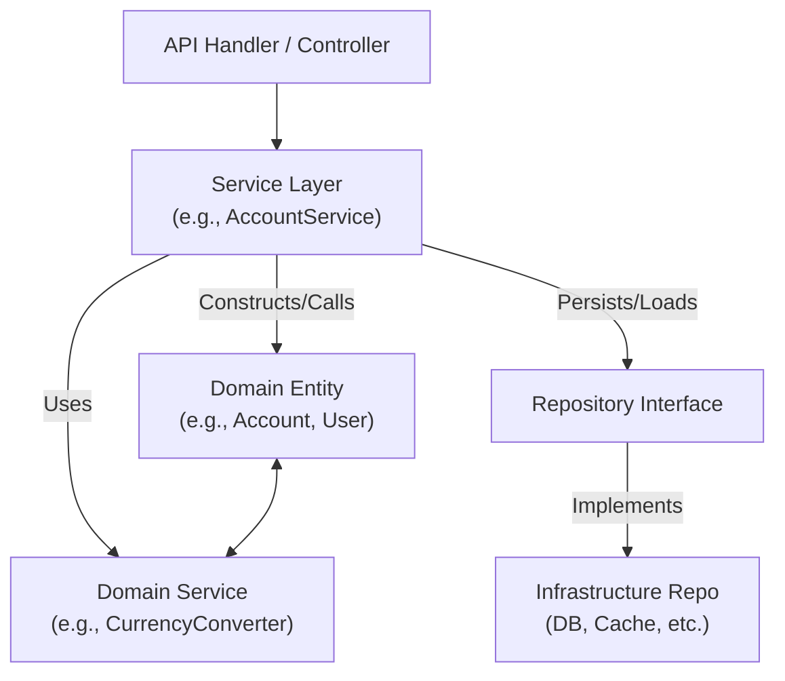

# Service Domain Layer Communication

This project follows clean architecture principles, with clear separation between the service and domain layers.

## Diagram



- **API Handler**: Receives request, calls service.
- **Service Layer**: Orchestrates use case, manages transactions, calls domain logic.
- **Domain Entity/Service**: Contains business rules, invariants.
- **Repository**: Abstracts persistence, injected into service.
- **Infrastructure**: Actual DB/cache implementation.

## Example: Account Deposit

**Domain Layer (`pkg/domain/account.go`):**

```go
func (a *Account) Deposit(userID uuid.UUID, money Money) (*Transaction, error) {
    if userID != a.UserID {
        return nil, ErrUserUnauthorized
    }
    if money.Amount <= 0 {
        return nil, ErrInvalidAmount
    }
    a.Balance += money.Amount
    tx := NewTransaction(a.ID, userID, money)
    return tx, nil
}
```

**Service Layer (`pkg/service/account.go`):**

```go
func (s *AccountService) Deposit(userID, accountID uuid.UUID, amount float64, currencyCode currency.Code) (*domain.Transaction, *domain.ConversionInfo, error) {
    // ...
    tx, err := account.Deposit(userID, money)
    if err != nil {
        _ = uow.Rollback()
        return nil, nil, err
    }
    err = repo.Update(account)
    if err != nil {
        _ = uow.Rollback()
        return nil, nil, err
    }
    // ...
}
```

- **Service Layer**: Orchestrates the use case, manages transactions, and coordinates repositories.
- **Domain Layer**: Enforces business rules and invariants.
- **Repositories**: Abstract persistence, injected into services.
- **Unit of Work**: Ensures atomicity of operations.

## DTOs and Domain Invariants

DTOs (Data Transfer Objects) are used strictly for moving data between layers (API, service, repository). All business rules and invariants must be enforced in the domain layer. Always convert DTOs to domain models before applying any business logic or persisting data. Repositories should never enforce business rules—this keeps the domain pure and the system maintainable.

---

## 🧩 Event-Driven Architecture: Notes & Lessons (2024 Refactor)

- **Event Bus Pattern:** All business flows (deposit, withdraw, transfer) use an event bus to decouple event emission from handling. Handlers are registered for specific event types, not for generic interfaces or central switch/if logic.
- **SRP & DRY:** Each handler is responsible for a single event type and business concern. Shared logic is factored into helpers or interfaces only when multiple stable use cases exist.
- **Payment Initiation is Flow-Agnostic:** The payment initiation handler accepts both deposit and withdraw validated events, extracting the required fields without caring about the flow type. This avoids unnecessary branching and keeps the handler extensible.
- **Cycle Detection:** A static analysis tool (`scripts/event_cycle_check.go`) is used to detect event cycles and is integrated into pre-commit hooks to prevent infinite event loops.
- **Consistent Logging:** All handlers use structured, emoji-rich logging for clarity and traceability.
- **Legacy Cleanup:** All legacy event types and handlers have been removed for clarity and maintainability.
- **Design Lessons:**
    - Prefer explicit handler registration for extensibility and SRP.
    - Use interfaces for shared event contracts only when justified by multiple stable use cases (YAGNI principle).
    - Avoid "refactor ping-pong" between switch/if and abstraction by documenting design decisions and refactoring only when requirements change.

See the main `README.md` for a summary and further references.
